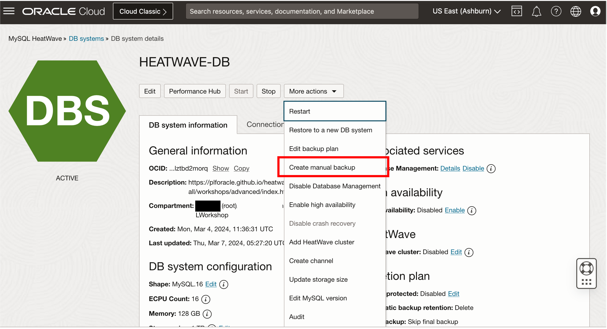
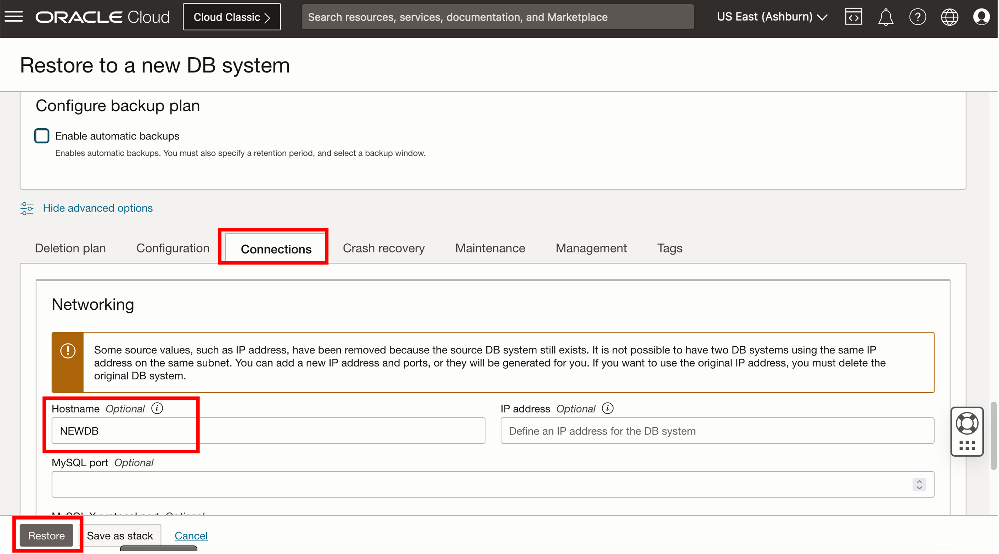

# Backup MySQL DB System


## Introduction

In this lab, you will learn to manage backups in a MySQL DB System.

_Estimated Time:_ 15 minutes


### Objectives

In this lab, you will be guided through the following tasks:

- Create a Manual Backup 
- Edit the Backup Plan of a DB System
- Restore to a new DB System from a Manual Backup
- Restore to a new DB System from a Point-in-Time
- Delete unused MySQL Backups

### Prerequisites

- An Oracle Trial or Paid Cloud Account
- Completed Task 3


## Task 1: Create a Manual Backup

1. Click **Navigation Menu**

    

2. Click  **Databases**, then **DB Systems**  
    

    Make sure you are using the root compartment
    

3. Click on **HEATWAVE-DB** to view the deatils.  
    

4. From the **More Actions** menu, select **Create Manual Backup** 
    

5. Fill in the information requested and then click on **Create Manual Backup**
    * Display Name: Manual Backup
    * Leave the description as is
    * Backup Type: Full Backup
    * Leave the Retention Period as is

    

    **Note**: It may take a few minutes for the backup to complete

6. Click **Navigation Menu**, click  **Databases**, then **Backups**  
    

    Confirm that Manual backup has been created successfully
    


## Task 2: Edit a Backup Plan

1. Click **Navigation Menu** 

    

2. Click  **Databases**, then **DB Systems**  
    

     Make sure you are using the root compartment
    

3. Click on **HEATWAVE-DB** to view the deatils.  
    

4. From the **More Actions** menu, select **Edit Backup Plan** 
    

5. Enable **Automatic Backups** and fill the requested information
    * Backup Retention Period: 1
    * Window Start Time: 07:00 UTC
    * Enable Point in Time Recovery

     

6. Click **Show backup windows per region**. A list of all backup windows per region will appear. If you don't define a backup window, Oracle will select one for you based on your region
    

7. Click **Save Changes** 


## Task 3: Restore a Backup to a New DB System

1. From the **More Actions** menu on your **HEATWAVE-DB** database, select **Restore to a new DB System** 
    

2. Select **Restore from a backup**, then click the **Select backup** button to open the **Browse all backup** page 

    

3. Click the **Manual** button and select the check box next to the **Manual Backup** you created before. Then Click **Select Backup** 
    

4. Ensure the root compartment is selected and enter the name of the new DB System, and Select **Standalone** option
    ```bash
    <copy>NEWDB</copy>
    ```
    

5. Under Configure Networking section, ensure the HEATWAVE-VCN and its private subnet are selected 
    

6. Ensure that the **MySQL.HeatWave.VM.Standard** shape is selected. 

    

    If not, click on **Change Shape** and look for and select the **MySQL.HeatWave.VM.Standard** shape.

7. Leave **Data Storage Size** as it is.

8. On Configure Backups, disable 'Enable Automatic Backup'

     

9. Click on **Show Advanced Options** and go to the **Connections** tab, assign **NEWDB** as the new hostname. 

    Then click **Restore**

    

    **Note**: It may take a few minures for the DB system to be created. When the DB System satate changes to Active, the DB System is ready to use.


## Task 4: Restore a Backup to a New DB System at a Point in Time

1. 1. Click **Navigation Menu**

    

2. Click  **Databases**, then **DB Systems**  
    

    Make sure you are using the root compartment
    

3. Click on **HEATWAVE-DB** to view the deatils.  
    

4. From the **More Actions** menu on your **HEATWAVE-DB** database, select **Restore to a new DB System** 
    

5. Next, select **Restore from DB System at a point in time** option, and click on the **latest available point-in-time**

    


6. Ensure the root compartment is selected and enter the name of the new DB System, and Select **Standalone** option
    ```bash
    <copy>NEWDB2</copy>
    ```
    

7. Under Configure Networking section, ensure the HEATWAVE-VCN and its private subnet are selected 
    

8. Ensure that the **MySQL.HeatWave.VM.Standard** shape is selected. 

    

    If not, click on **Change Shape** and look for and select the **MySQL.HeatWave.VM.Standard** shape.

9. Leave **Data Storage Size** as it is.

10. On Configure Backups, disable **'Enable Automatic Backup'**

     

11. Click on **Show Advanced Options** and go to the **Connections tab**, assign **NEWDB** as the new hostname. 

    Then click **Restore**
    

    **Note**: It may take a few minures for the DB system to be created. When the DB System satate changes to Active, the DB System is ready to use.

## Task 5: Delete a Backup

1. Click **Navigation Menu**

    

2. Click  **Databases**, then **Backups**  
    

    Make sure you are using the root compartment
    

3. Click the **Actions** button next to the Manual Backup you created previously, and select **Delete** from the drop-down menu
    

4. A pop-up window will appear asking you to confirm that you want to delete the backup, click **Delete Backup**
    

5. When the backup is deleted, its state will change to **Deleted** and it cannot be restored. 
    

    > **Note**: 
    - It may take a few minutes for the backup to be deleted.
    - Disable PITR (as it’s not compatible with Lakehouse) or disable backups completely to avoid issues later.
 
You may now **proceed to the next lab**

## Acknowledgements

- **Author** - Selena Sanchez, MySQL Solution Engineering 
- **Contributors** - Mandy Pang, MySQL Principal Product Manager,  Nick Mader, MySQL Global Channel Enablement & Strategy Manager, Perside Foster, MySQL Principal Solution Engineering
- **Last Updated By/Date** - Selena Sanchez, MySQL Solution Engineering, March 2024