# Configure MySQL HeatWave DB System


## Introduction

In this lab, you will learn to manage configurations in a MySQL DB System.

_Estimated Time:_ 15 minutes


### Objectives

In this lab, you will be guided through the following tasks:

- Create a MySQL Configuration 
- Copy a MySQL Configuration, change variables and compare them
- Update the MySQL Configuration of a DB system
- Delete unused MySQL Confiigurations

### Prerequisites

- An Oracle Trial or Paid Cloud Account
- Completed Task 3


## Task 1: Create a MySQL Configuration

1. Click **Navigation Menu**

    

2. Click  **Databases**, then **Configurations**  
    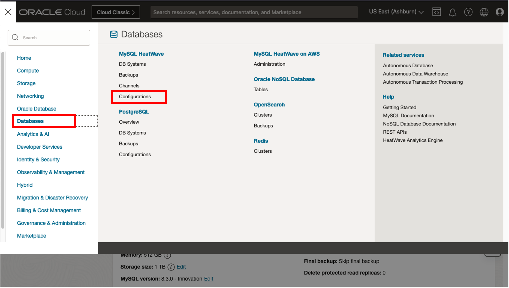

    Make sure you are using the root compartment
    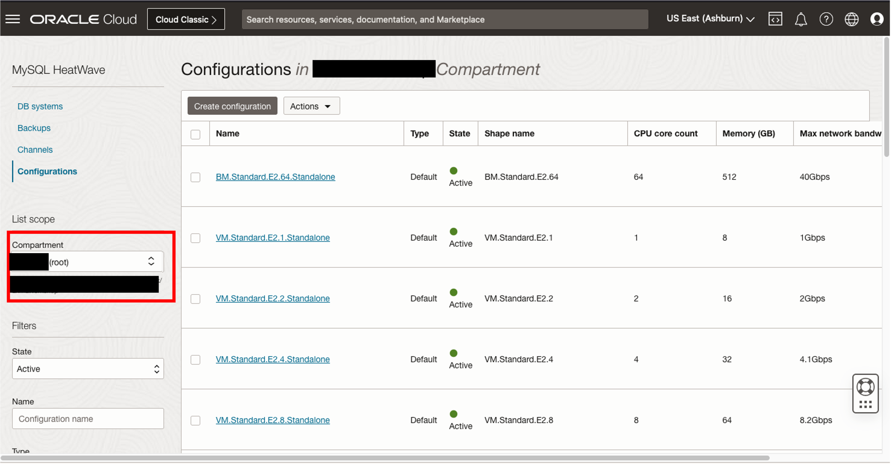

3. Select the Click **Create Configuration**
    

    Enter a name for your configuration: 

    ```bash
    <copy>MyConfig</copy>
    ```
  
    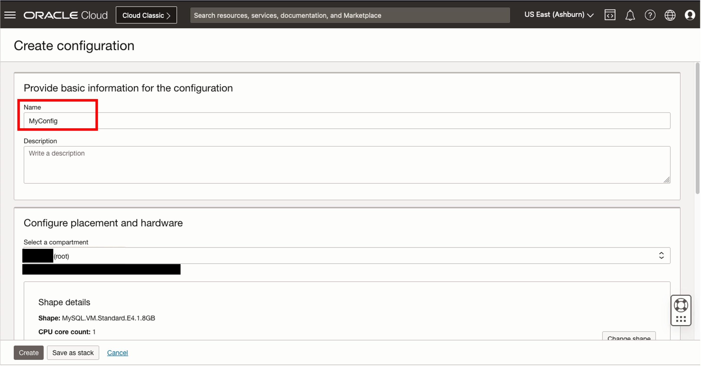

    
4. Click the **Change Shape** button 
    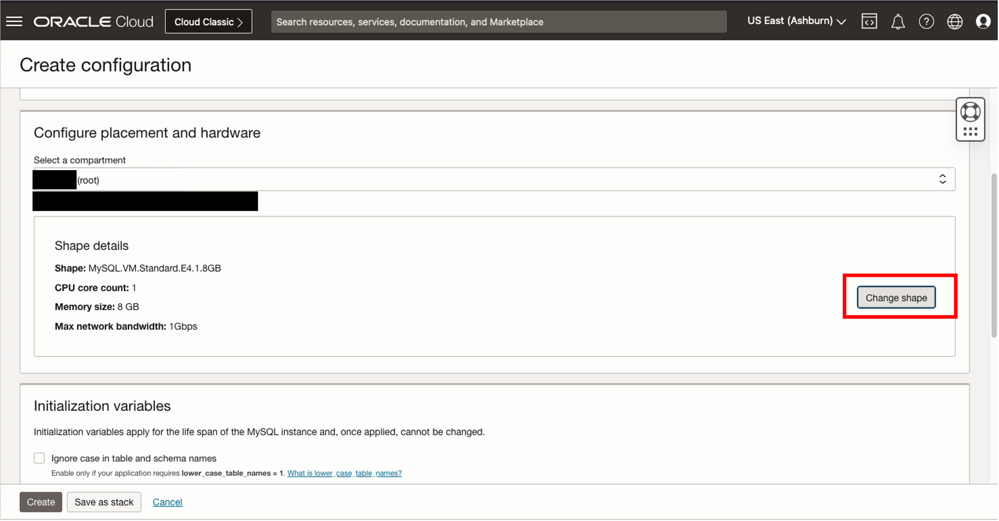
    
5. Select the **OCPU** tab and look for and select the **MySQL.HeatWave.VM.Standard** shape. Then click **Select Shape**
    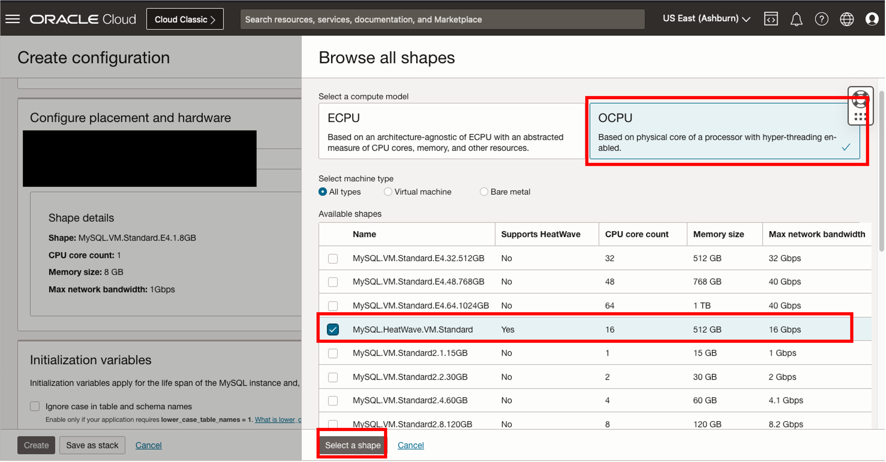

6. Scroll down, the Variables Information page is displayed. In the **User Variables (Read/Write)** sectiion add the following variables and values:

    * Set **max_connections** to 200
    * Set **sort\_buffer\_size** to 500000
    * Set **time\_zone** to +01:00

    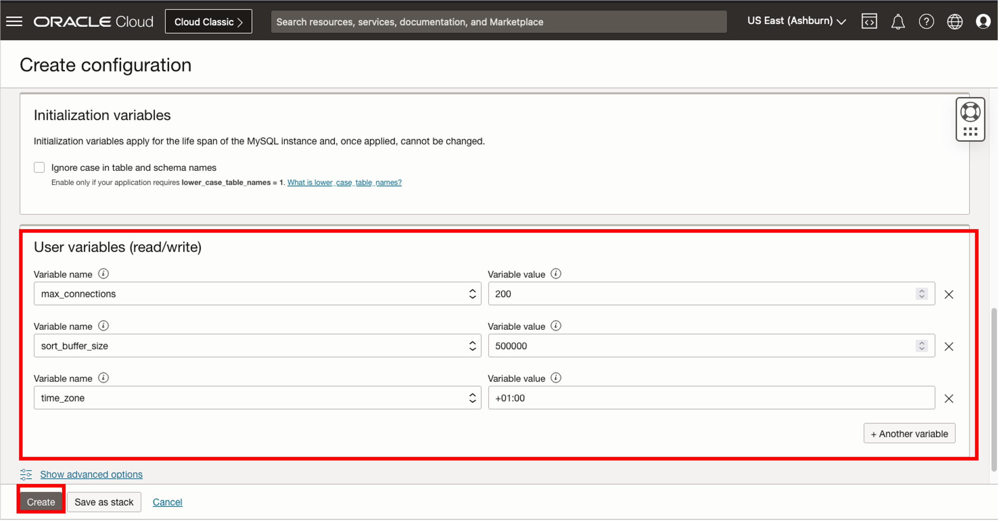

    **Note:** You can click the **+Another Variable** to add more rows for configuring more variables

7. Click **Create** to create the configuration. The configuration Details page is displayed. 
    

8. Scroll down to see the variables that you have configured
    


## Task 2: Copy a MySQL Configuration

1. On the MyConfig Details page, click **Copy Configuration** to make copy of the MyConfig configuration. 
    

2. The configuration copy page is displayed, enter a name for the configuration:

    ```bash
    <copy>MyConfig2</copy>
    ```

    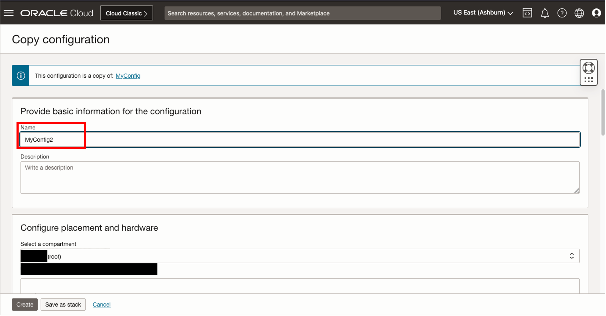

3. Scroll Down and click the **Initialization Variiables** tab, and enable the **Ignore case in table and schema names** option

    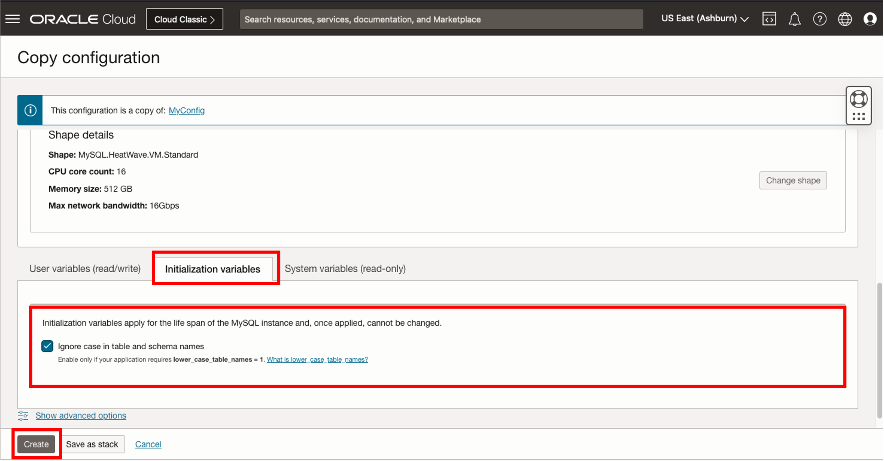

4. Click **Create** to create the MyConfig2 configuration

5. Go back to the configurations list page
    

6. Click the context menu of MyConfig and click **Copy Configuration**
    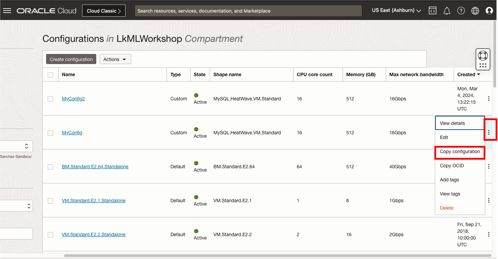

7. The configuration copy page is displayed, enter a name for the configuration:

    ```bash
    <copy>MyConfig3</copy>
    ```
    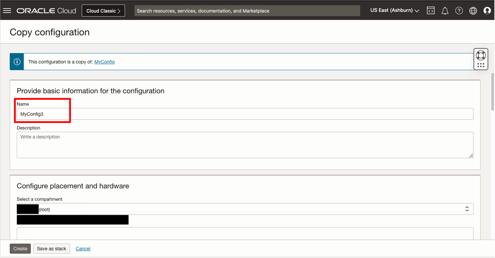

8. Scroll down to the **User variables (read/write)** tab and perform the following changes:
    * Change the value of **max_connections** to 300
    * Change the value **time_zone** to +02:00. 
    * Click **+Another Variable** to add another row.

    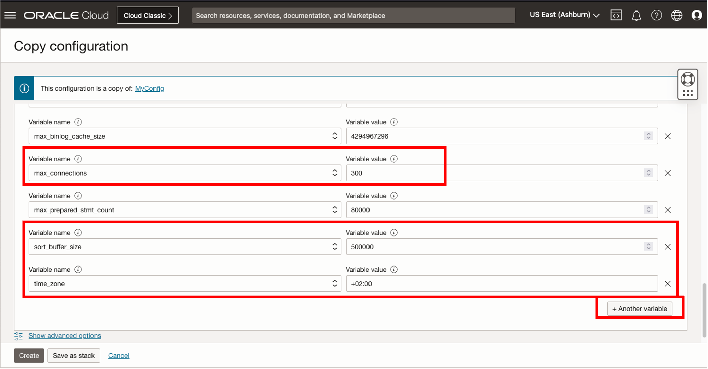

    *  Add the **autocomit** variable and set its value to **OFF** 

    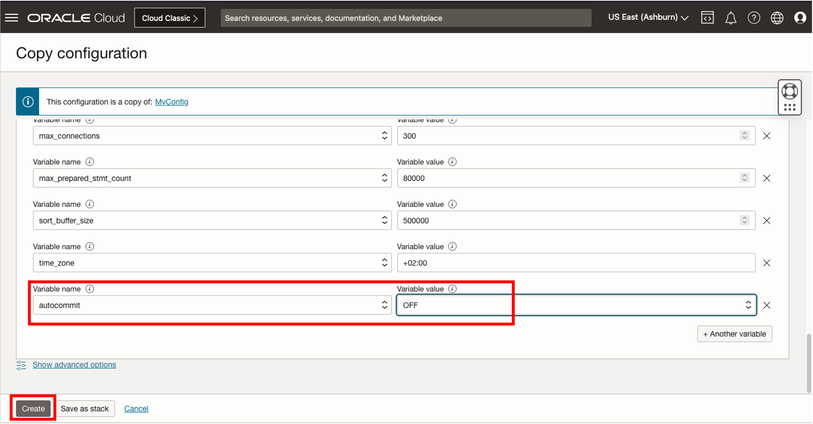

9. Click **Create** to create MyConfig3 


## Task 3: Comparing two MySQL Configuration

1. Go back to the configurations list page 
    
    
2. Select the **MyConfig2** and **MyConfig 3** confiigurations from the configurations list by selecting the check boxes. 
    Then click the **Actions** button and select **Compare** from the drop-down menu

    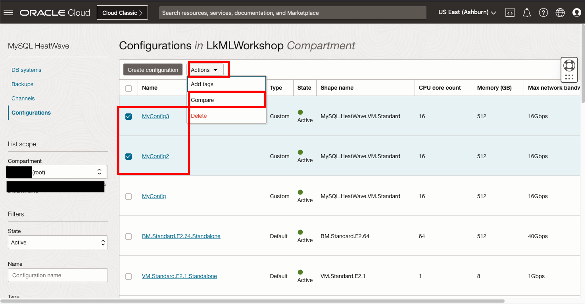

3. The Compare configurations dialog box is shown. It shows the differences by **default**. 

    

    * If you want to view all information of both configurations, click the **Show all** configuration Information button. 
    
    

4. Click **Close**. 

## Task 4: Update the Configuration of a DB System

1. Click **Navigation Menu**, click  **Databases**, then **DB Systems**  
    

2. Click on **EATWAVE-DB** to view the deatils.  
    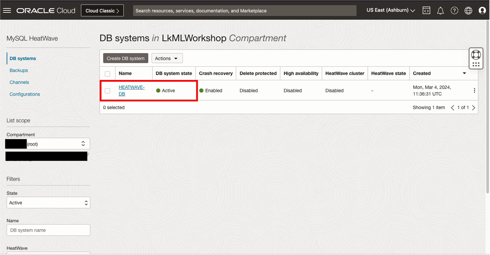

3. Click the **Edit** button to edit the DB System
    

4. The edit DB system page is shown. Scroll down to the Configuration section, click the **Change Configuration** button to choose a different configuration.
    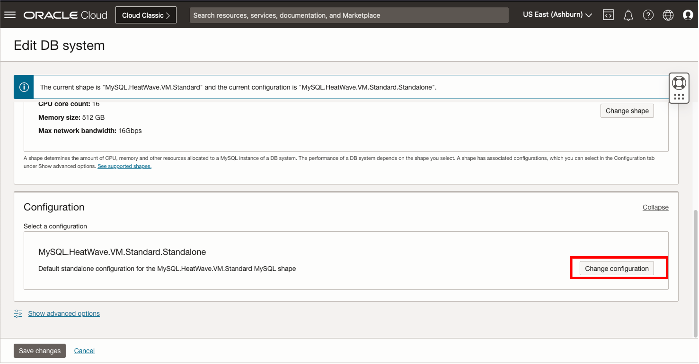

5. The browse configuration dialog is displayed. Note that it only lists all configurations **that match the shape of the DB System**
    
    Click the Custom button to hide the default configurations 

    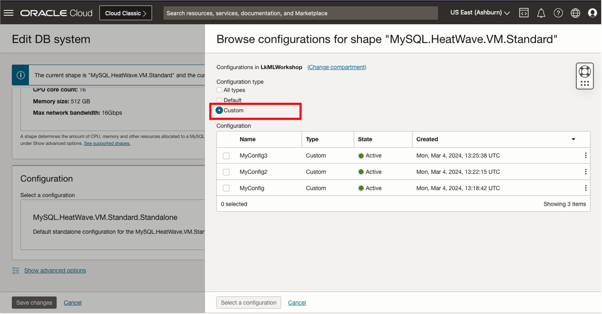

6. Select **MyConfig2** configuration. 
    * An error message is displayed, this is because the initilization variable cannot be changed once the DB System has been deployed. 

    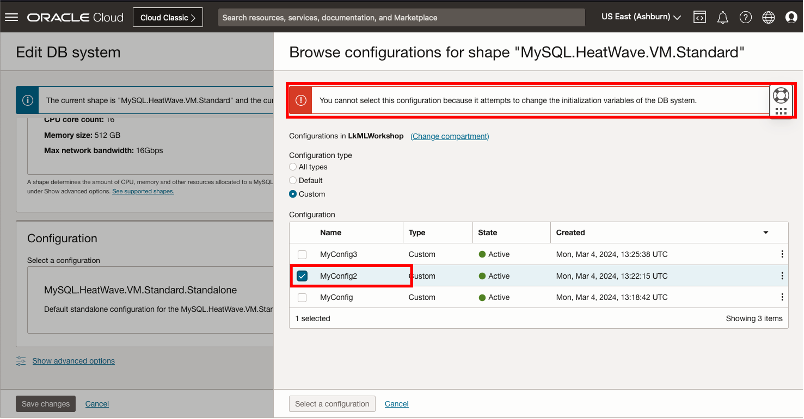
    
7. Select the **MyConfig3** configuration and click **Select a Configuration**. 
    

8. Click **Save Changes** in the Edit DB System page. HEATWAVE-DB changes to an updating state, after changing the configuration, the database needs to be restarted for the changes to take effect. 
    

9. After it has restared, the database will change to **ACTIVE** state and the configuration shows MyConfig3. 
    


## Task 5: Delete MySQL Configuration

1. Click **Navigation Menu**, then **Configurations**  
    

    Make sure you are in the root compartment
    

3. Select the **MyConfig3, MyConfig2 and MyConfig** configurations by selecting the respective check boxes, click the actions button and select the **Delete** from the drop down menu
    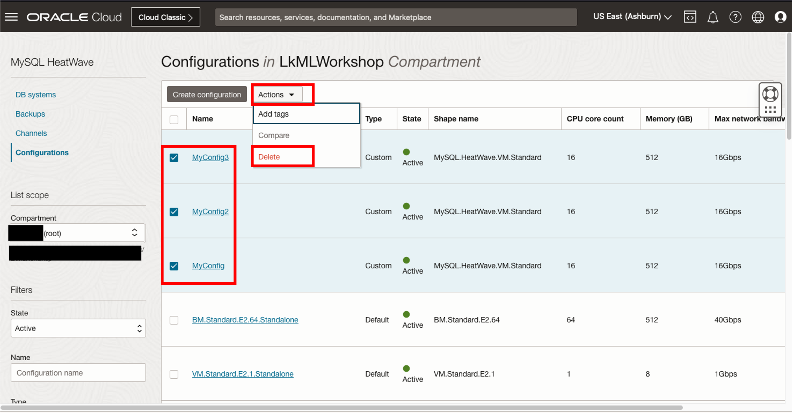

4. Click **Delete configurations** too confirm
    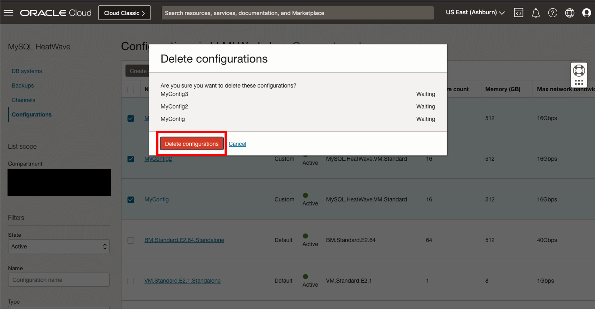

5. An error occurs and the deletion of the MyConfig3 configuration fails. Click **Show Details** to view the reason. 

    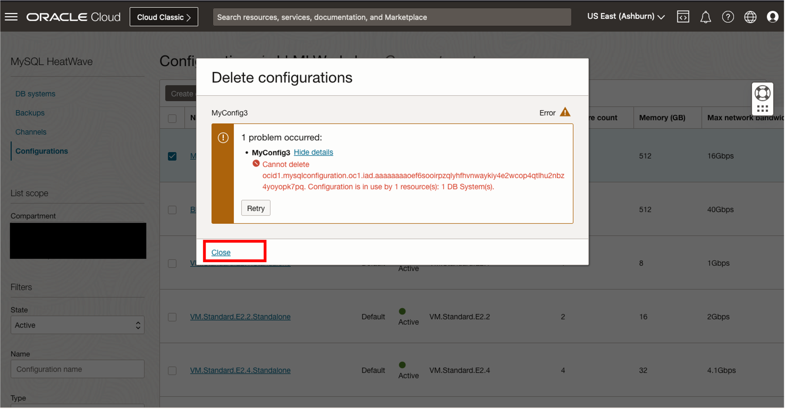
    
    As shown on the details, the MyConfig3 configuration cannot be deleted because it is currently being used by a DB system.
    Click close on the details page. 

6. On the configuration list page, you will notice that MyConfig2 and MyConfig configurations have been deleted.
    


You may now **proceed to the next lab**

## Acknowledgements

- **Author** - Perside Foster, MySQL Principal Solution Engineering
- **Contributors** - Mandy Pang, MySQL Principal Product Manager,  Nick Mader, MySQL Global Channel Enablement & Strategy Manager
- **Last Updated By/Date** - Selena Sanchez, MySQL Solution Engineering, March 2024