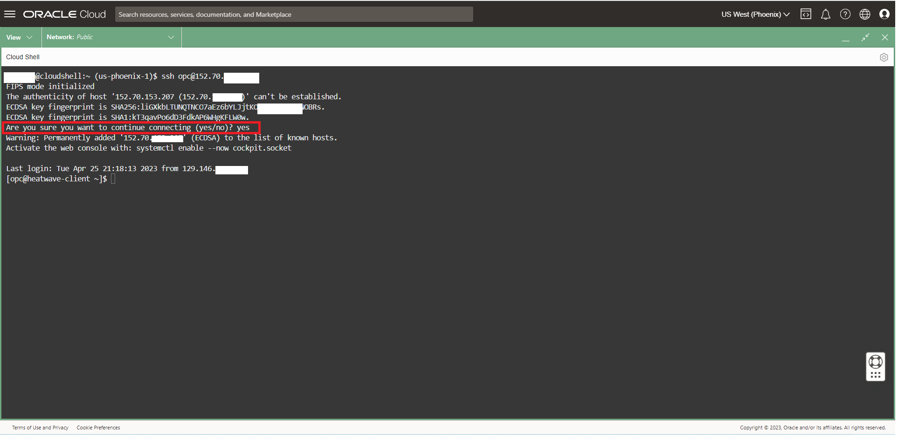
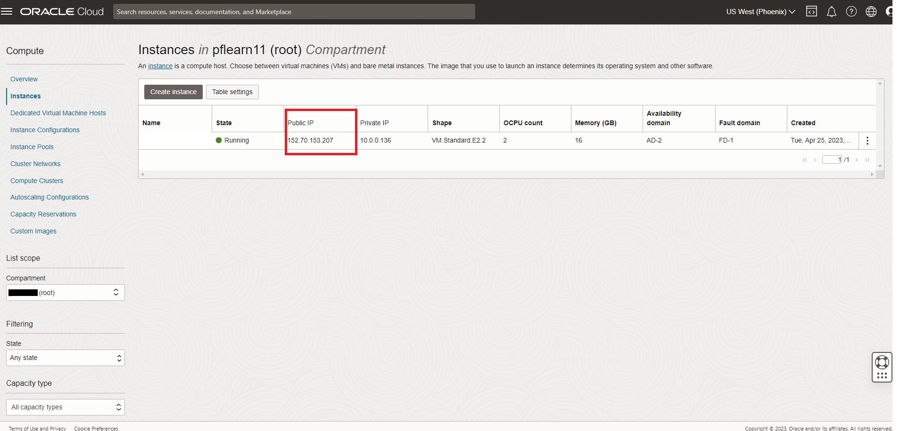
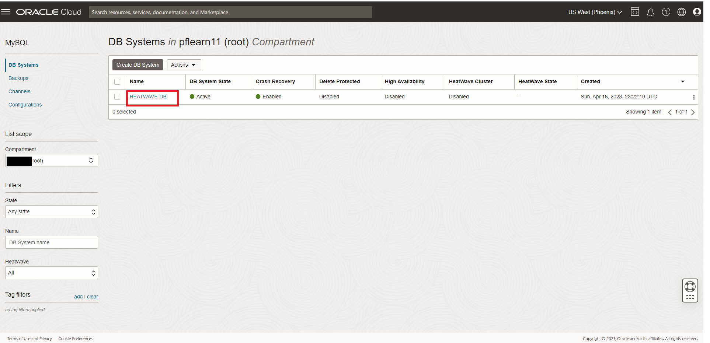

# Connect to HeatWave with MySQL Shell and Workbench


## Introduction

You cannot connect directly from a remote IP to the endpoint of a DB system. Use SSH or RDP to connect to a compute instance, and from the compute instance use MySQL Shell, MySQL Client or MySQL Workbench to connect to the DB system.For more details see OCI Document:

[Connecting to a DB System with Compute Instance](
https://docs.oracle.com/en-us/iaas/mysql-database/doc/compute-instance.html#GUID-6087DA45-06E0-44AD-9CAB-0FC37423A07A).


_Estimated Lab Time:_ 10 minutes

### Objectives

In this lab, you will be guided through the following tasks:

- Connect to Compute System
- Get MySQL HeatWave Database Endpoint
- Install MySQL Shell on the Compute Instance
- Use MySQL Shell to load the airport-db database
- Connect to Databsae with MySQL Workbench

### Prerequisites

- An Oracle Trial or Paid Cloud Account
- Some Experience with MySQL Shell


## Task 1: Connect to the Compute System

1. Go to Cloud shell to SSH into the new Compute Instance

2. Enter the username **opc** and the Public **IP Address**.

    Note: The **HEATWAVE-Client**  shows the  Public IP Address as mentioned on TASK 5: #1

    (Example: **ssh -i ~/.ssh/id_rsa opc@132.145.170...**) 

    ```bash
    <copy>ssh -i ~/.ssh/id_rsa opc@<your_compute_instance_ip></copy>
    ```

3. For the **Are you sure you want to continue connecting (yes/no)?**
    - answer **yes**

    


## Task 2: Get MySQL HeatWave Database Endpoint

1. Copy the public IP address of the active Compute Instance to your notepad

    - Go to Navigation Menu
        - Compute
        - Instances
        - Copy **Public IP**
    

2. Copy the private IP address of the active MySQl Database Service Instance to your notepad

    - Go to Navigation Menu 
        - Databases 
        - MySQL
        - Click the `HEATWAVE-DB` Database System link
     

3. Copy the HEATWAVE-DB  `Private IP Address` to the notepad
     

4. Your notepad should look like the following:
     

## Task 3: Connect to Database with MySQL Shell

1. From your Compute instance, connect to HEATWAVE-DB  using the MySQL Shell client tool.

   The endpoint (IP Address) can be found in your notepad or  the MHEATWAVE-DB  System Details page, under the "Endpoint" "Private IP Address". 

    

2. Use the following command to connect to MySQL using the MySQL Shell client tool. Be sure to add the MDS-HW private IP address at the end of the command. Also enter the admin user and the db password created on Lab 1

    (Example  **mysqlsh -uadmin -p -h10.0.1..**)

    **[opc@...]$**

    ```bash
    <copy>mysqlsh -uadmin -p -h 10.0.1... </copy>
    ```

    

3. On MySQL Shell, switch to SQL mode

    ```bash
    <copy>\sql</copy>
    ```

4. List all of the HeatWave Schemas

    ```bash
    <copy>SHOW DATABASES;</copy>
    ```

5. Display the database version, current date, and your username

    ```bash
    <copy>SELECT VERSION(), CURRENT_DATE, USER();</copy>
    ```

6. Display MysQL user and host from the user table

    ```bash
    <copy>SELECT VERSION(), CURRENT_DATE, USER();</copy>
    ```

## Task 4: Use MySQL Shell to load the airport-db database

The installation procedure involves downloading the airportdb database to cloud shell and importing the data from cloud shell into the MySQL DB System using the MySQL Shell Dump Loading utility. For information about this utility, see Dump Loading Utility: [https://dev.mysql.com/doc/mysql-shell/8.0/en/mysql-shell-utilities-load-dump.htmly](https://dev.mysql.com/doc/mysql-shell/8.0/en/mysql-shell-utilities-load-dump.html)

1. Change JavaScript mode

    ```bash
    <copy>\js</copy>
    ```

2. Load the airportdb database into the MySQL DB System using the MySQL Shell Dump Loading Utility.

    ```bash
    <copy>util.loadDump("https://objectstorage.us-ashburn-1.oraclecloud.com/p/4TAWm0ayQtIPsxmZqDRNt9j3xxG83Ztjv-YVa7czxzdtu7H-rTKivnkUey97YIQG/n/mysqlpm/b/mysql_airport/o/airportdball/", {threads: 16,progressFile: "progress.json", loadIndexes:false,ignoreVersion:true})</copy>
    ```

    

3. View  the airportdb total records per table

    ```bash
    <copy>\sql</copy>
    ```

    ```bash
    <copy>SELECT table_name, table_rows FROM INFORMATION_SCHEMA.TABLES WHERE TABLE_SCHEMA = 'airportdb';</copy>
    ```

    

4. Exit MySQL Shell

    ```bash
    <copy>\q</copy>
    ```

## Task 5: Connect to Databsae with MySQL Workbench

You can use MySQL Workbench from your local machine to connect to the MySQL endpoint using your the compute instance as a jump box.

1. In your pre-installed **MySQL Workbench**, configure a connection using the **Standard TCP/IP over SSH** method and use the credentials of the compute instance for SSH.

2. MySQL Workbench configuration for MySQL HeatWave:

     

3. MySQL Workbench launched for MySQL HeatWave :

     

You may now **proceed to the next lab**

## Acknowledgements

- **Author** - Perside Foster, MySQL Principal Solution Engineering
- **Contributors** - Mandy Pang, MySQL Principal Product Manager,  Nick Mader, MySQL Global Channel Enablement & Strategy Manager, Selena Sanchez, MySQL Solution Engineering
- **Last Updated By/Date** - Perside Foster, MySQL Solution Engineering, March 2024