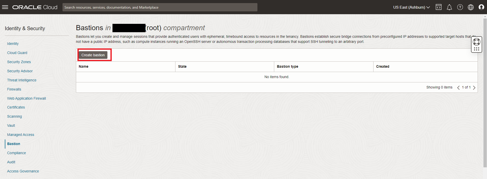
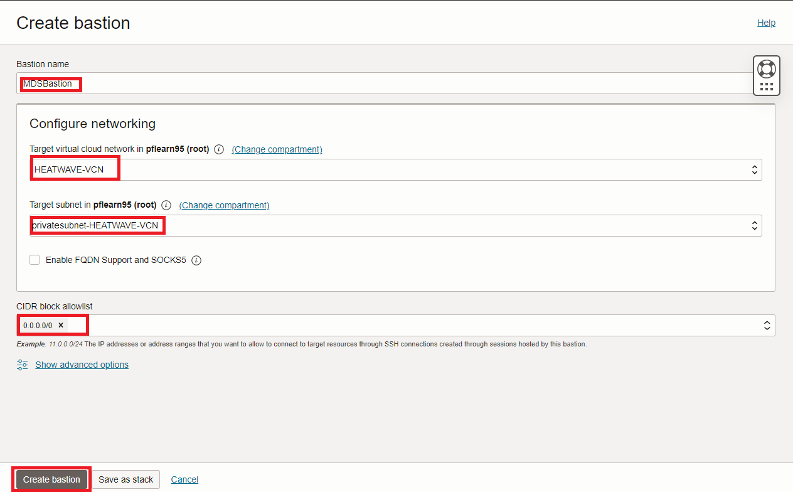
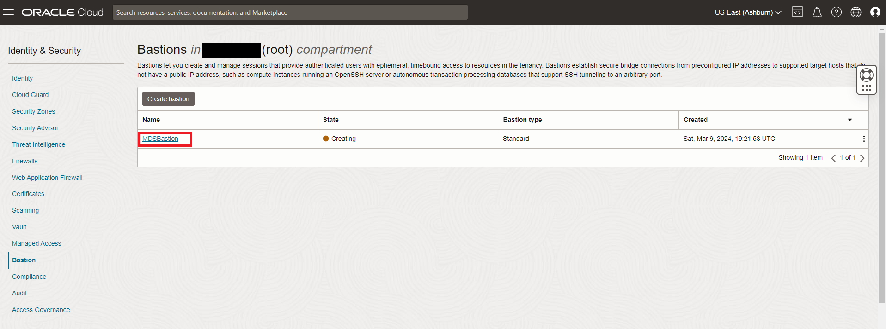
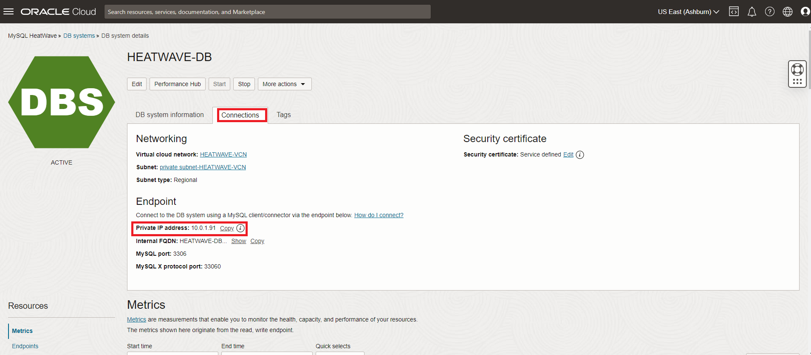
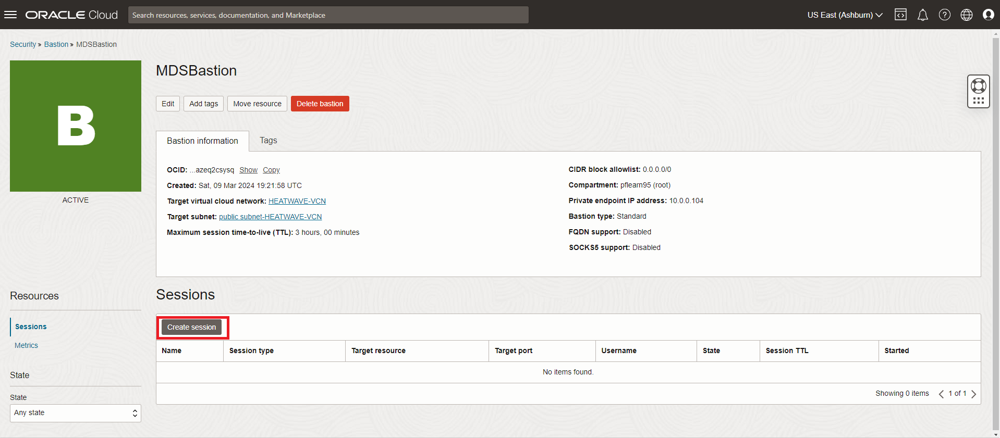
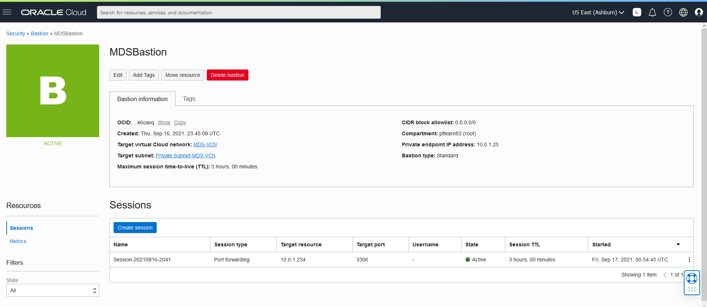
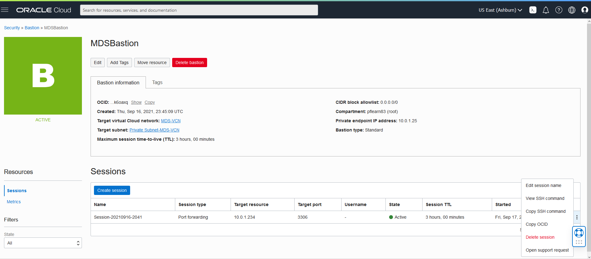
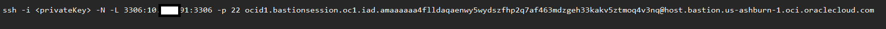

# Connect to HeatWave with OCI Bastion


## Introduction

When working in the cloud, there are often times when your servers and services are not exposed to the public internet. The Oracle Cloud Infrastructure (OCI) MySQL cloud service is an example of a service that is only accessible via private networks. Since the service is fully managed, we keep it siloed away from the internet to help protect your data from potential attacks and vulnerabilities. It’s a good practice to limit resource exposure as much as possible, but at some point, you’ll likely want to connect to those resources. That’s where bastion hosts enter the picture. A bastion host is a resource that sits between the private resource and the endpoint which requires access to the private network and can act as a “jump box” to allow you to log in to the private resource via protocols like SSH or RDP.  The bastion host requires a Virtual Cloud Network to connect with the MySQL DB Systems.

Oracle added a Bastion Service to OCI. And you may also have noticed that the OCI Dashboard offers you the possibility to use a browser based terminal: Cloud Shell.

Today, you will use these two components to connect from the browser to a MDS DB System

Estimated Lab Time 15 minutes

### Objectives

In this lab, you will be guided through the following tasks:

- Setup Bastion Service
- Create Bastion session
- Connect to MySQL DB System

### Prerequisites

- An Oracle Trial or Paid Cloud Account
- Some Experience with MySQL Shell

## Task 1: Create Bastion Service

The new Bastion Service will allow you to create a SSH Tunnel to your MySQL DB System.

1. Go to Navigation Menu > Identity Security > Bastion

    

2. Click Create Bastion

    

3. On Create bastion, complete the following fields:

    Bastion Name

     ```bash
     <copy>MDSBastion</copy>
     ```

    Target virtual Cloud network in .. (root)

    Select  `HEATWAVE-VCN`

    Target subnet in .. (root)

    Select  `Private Subnet-HEATWAVE-VCN`

    CIDR block allowlist (As you don’t know the IP of the Cloud Shell, use 0.0.0.0/0)

     ```bash
     <copy>0.0.0.0/0</copy>
     ```

    Click `0.0.0.0/0(New)`

     

4. Click `Create Bastion` button

    When completed your screen should look like this:

    

## Task 2: Create Bastion Session

1. Before creating the Bastion Session open a notepad. Do the following steps to record the MySQL Database System private IP address:

    - Go to Navigation Menu > Databases > MySQL
     

    - Click on the `HEATWAVE-DB` Database System link. 

     

    - Go to the **Connections** tab and copy the **Private IP address** to the notepad

2. Do the followings steps to copy  the public SSH key to the  notepad

    - Open the Cloud shell
     

    - Enter the following command

    ```bash
     <copy>cat .ssh/id_rsa.pub</copy>
    ```

    

3. Copy the id\_rsa.pub content from the notepad.
        Your notepad should look like this
      

    >**Note** Make sure you have a copy of your id\_rsa and Id\_rsa.pub files in your local ~/.ssh folder. If not download it from the cloud shell where you originally created it. 

4. Go to Navigation Menu > Identity Security > Bastion

5. Click the `MDSBastion` link

     

6. Click `Create Session`

7. Set up the following information
    - Session type
      Select `SSH port forwarding session`
    - Session Name
        *Keep Default*
    - IP address
        *Enter HeatWave DB IP address ( from notepad)*

8. Enter the Port

    ```bash
        <copy>3306</copy>
    ```

9. Add SSH Key -  Copy SSH Key from notepad
    - The screen should look like this
    
    - Click the `Create Session` button
10. The completed Bastion Session should look like this
    

    **Note: The Session will expire in 180 minutes**

## Task 3: Connect to MySQL HeatWave with Bastion Session

1. Click on the 3 vertical dots on the Bastion Session

    

2. Click `View SSH Command`  

    

3. Click copy and paste the information to your notepad and hit Close

4. update the session command on notepad
    - Set the beginning of the command `ssh -i <privateKey> -N -L 3306`
    - Add the verbose (-v) option to the SSH command for detailed information about the connection.

    The command from your notepad should look like this

    

5. Open a Windows PowerShell or Mac Terminal and enter the command from the notepad. Add  the ssh file name  and the Database Port  value (3306) It should like this..

    *Don't forget the -v  character*

    `ssh -i ~/.ssh/id_rsa -N -L 3306:10.0.1.17:3306 -p 22 ocid1.bastionsession.oc1.iad.amaaaaaa47ys2xaabm3koownovovwekvkitudcvdjk6dc5qtl6c6mtwxdkuq@host.bastion.us-ashburn-1.oci.oraclecloud.com -v`

6. Use MySQL Shell to connect to the MySQL Database Service. Enter:

     ```bash
     <copy>mysqlsh admin@127.0.0.1 --sql</copy>
     ```

7. View  the airportdb total records per table in

    ```bash
    <copy>SELECT table_name, table_rows FROM INFORMATION_SCHEMA.TABLES WHERE TABLE_SCHEMA = 'airportdb';</copy>
    ```

    

**Note** You can also use  the bastion service to connect to your local computer and access  MySQL  with Workbench or Visual Studio Code

You may now **proceed to the next lab**

## Acknowledgements

- **Author** - Perside Foster, MySQL Principal Solution Engineering
- **Contributors** - Mandy Pang, MySQL Principal Product Manager,  Nick Mader, MySQL Global Channel Enablement & Strategy Manager, Selena Sanchez, MySQL Solution Engineering
- **Last Updated By/Date** - Perside Foster, MySQL Solution Engineering, April 2024