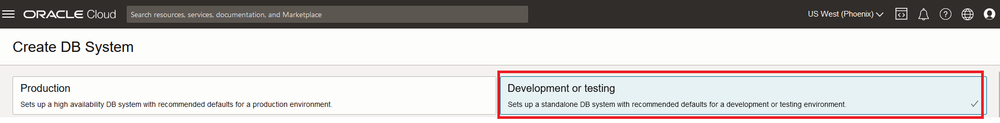
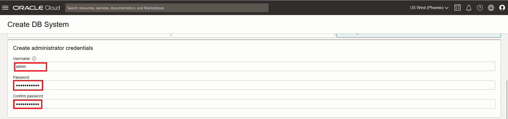
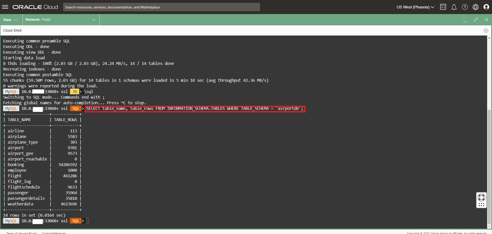

# Create MySQL HeatWave Instance


## Introduction

In this lab, you will create and configure a MySQL DB System.
For more details see OCI Document:
[Creating a DB System Using the Console](https://docs.oracle.com/en-us/iaas/mysql-database/doc/creating-db-system1.html#GUID-AE89C67D-E1B1-4F11-B934-8B0564B4FC69).

_Estimated Time:_ 20 minutes

### Objectives

In this lab, you will be guided through the following tasks:

- Create MySQL HeatWave (DB System) Instance

### Prerequisites

- An Oracle Trial or Paid Cloud Account
- Some Experience with MySQL Shell

## Task 1: Create MySQL Database for HeatWave (DB System) instance

1. You should be signed in to Oracle Cloud!

    Click on Navigation Menu > Databases > MySQL
         Databases
         MySQL
    

2. Click 'Create DB System'
    

3. Create MySQL DB System dialog by completing the fields in each section

    - Provide DB System information
    - Setup the DB system
    - Create Administrator credentials
    - Configure Networking
    - Configure placement
    - Configure hardware
    - Exclude Backups
    - Set up Advanced Options

4. For DB System Option Select **Development or Testing**

    

5. Provide basic information for the DB System:

    a. Select Compartment **(root)**

    b. Enter Name

    ```bash
    <copy>HEATWAVE-DB</copy>
    ```

    c. Enter Description

    ```bash
    <copy>MySQL HeatWave Database Instance</copy>
    ```

    d. Select **Standalone** and DISABLE **Configure MySQL HeatWave**
    

6. Create Administrator Credentials - **IMPORTANT** username must be set to **admin**  in order to successfully complete this workshop

    Username : **admin**

    Password*  (write password to notepad for later use)

    **Confirm Password** (value should match password for later use)

    

7. On Configure networking, keep the default values

    a. Virtual Cloud Network: **HEATWAVE-VCN**

    b. Subnet: **Private Subnet-HEATWAVE-VCN (Regional)**

    c. On Configure placement under 'Availability Domain'

    Select AD-1  ...  Do not check 'Choose a Fault Domain' for this DB System.

    

8. On Configure Backups, disable 'Enable Automatic Backup'

    

9. On Configure hardware
    - 1. **IMPORTANT** Check the  **Enable Heatwave** box
    - 2. Click the **Change shape** button to select **ECPU** then **MySQL.8** shape and and click the **Select a Shape** button
    - 3. Click the **Configure HeatWave Cluster** button 
        - Select **Change shape**
        - Select **HeatWave.512GB** shape
        - Set **Node** to 1
        - Check the **MySQL HeatWave Lakehouse** box
        - Click the **Save Changes** button
    - 4. For Data Storage Size (GB) Set value to:  **512**

    

10. **IMPORTANT**
    > **NOTE** In order to successfully complete this workshop you must execute **steps 11, 12, and 13**

11. Click on Show Advanced Options

12. **IMPORTANT** Go to the Configuration tab. Click on **Select a MySQL version** and select the latest MySQL version of the DB system.

    

13. **IMPORTANT** Go to the Connections tab, in the Hostname field enter (your DB System Name):

    ```bash
        <copy>HEATWAVE-DB</copy> 
    ```  

    

14. Review **Create MySQL DB System**  Screen

    
  
    Click the '**Create**' button

15. The New MySQL DB System will be ready to use after a few minutes

    The state will be shown as 'Creating' during the creation
    

16. The state 'Active' indicates that the DB System is ready for use

    On HEATWAVE-HW Page, select the **Connections** tab and save the **Private IP**

    


## Task 2: Connect to HeatWave Database

1. Go to Cloud shell to SSH into the Compute Instance

    (Example: **ssh -i ~/.ssh/id_rsa opc@132.145.170...**) 

    ```bash
    <copy>ssh -i ~/.ssh/id_rsa opc@<your_compute_instance_ip></copy>
    ```

2. Connect to the HeatWave Database using MySQL Shell with the following command:

    ```bash
    <copy>mysqlsh -uadmin -p -h 10.0.1... --sql </copy>
    ```

## Task 3: Use MySQL Shell to load the airport-db database

The installation procedure involves downloading the airportdb database to cloud shell and importing the data from cloud shell into the MySQL DB System using the MySQL Shell Dump Loading utility. For information about this utility, see Dump Loading Utility: [https://dev.mysql.com/doc/mysql-shell/8.0/en/mysql-shell-utilities-load-dump.htmly](https://dev.mysql.com/doc/mysql-shell/8.0/en/mysql-shell-utilities-load-dump.html)

1. Change JavaScript mode

    ```bash
    <copy>\js</copy>
    ```

2. Load the airportdb database into the MySQL DB System using the MySQL Shell Dump Loading Utility.

    ```bash
    <copy>util.loadDump("https://objectstorage.us-ashburn-1.oraclecloud.com/p/yXOA3Kwid4uG0oHvHMufbK3cSESmQlU6-0bVB_1vQ8VxR0ggB1m-nDYYOXXy0O5W/n/idazzjlcjqzj/b/airportdb-bucket-112312031/o/airportdb_all/", {threads: 8,progressFile: "progress.json", loadIndexes:false})</copy>
    ```

    

3. View  the airportdb total records per table

    ```bash
    <copy>\sql</copy>
    ```

    ```bash
    <copy>SELECT table_name, table_rows FROM INFORMATION_SCHEMA.TABLES WHERE TABLE_SCHEMA = 'airportdb';</copy>
    ```

    

4. Exit MySQL Shell

    ```bash
    <copy>\q</copy>
    ```

You may now **proceed to the next lab**

## Acknowledgements

- **Author** - Perside Foster, MySQL Principal Solution Engineering
- **Contributors** - Mandy Pang, MySQL Principal Product Manager,  Nick Mader, MySQL Global Channel Enablement & Strategy Manager, Selena Sanchez, MySQL Solution Engineering
- **Last Updated By/Date** - Perside Foster, MySQL Solution Engineering, April 2024