# Create MySQL HeatWave Instance


## Introduction

In this lab, you will create and configure a MySQL DB System.
For more details see OCI Document:
[Creating a DB System Using the Console](https://docs.oracle.com/en-us/iaas/mysql-database/doc/creating-db-system1.html#GUID-AE89C67D-E1B1-4F11-B934-8B0564B4FC69).

_Estimated Time:_ 20 minutes

### Objectives

In this lab, you will be guided through the following tasks:

- Create Virtual Cloud Network
- Create MySQL HeatWave (DB System) Instance

### Prerequisites

- An Oracle Trial or Paid Cloud Account
- Some Experience with MySQL Shell

## Task 1: Create Virtual Cloud Network

1. You should be signed in to Oracle Cloud!

    Click **Navigation Menu**,

    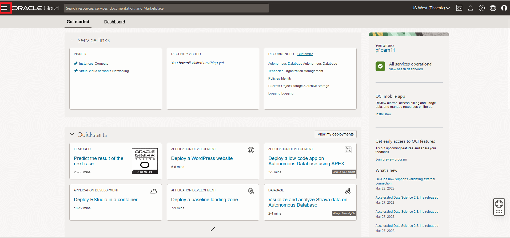

2. Click  **Networking**, then **Virtual Cloud Networks**  
    

    Select the root compartment
    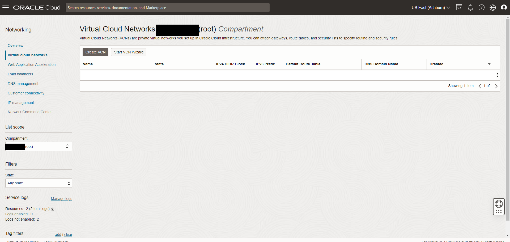

3. Select the Click **Start VCN Wizard**
    

4. Select 'Create VCN with Internet Connectivity'

    Click 'Start VCN Wizard'
    

5. Create a VCN with Internet Connectivity

    On Basic Information, complete the following fields:

    VCN Name:

    ```bash
    <copy>HEATWAVE-VCN</copy>
    ```

    Compartment: Select  **(root)**

    Your screen should look similar to the following
    

6. Click 'Next' at the bottom of the screen

7. Review Oracle Virtual Cloud Network (VCN), Subnets, and Gateways

    Click 'Create' to create the VCN
    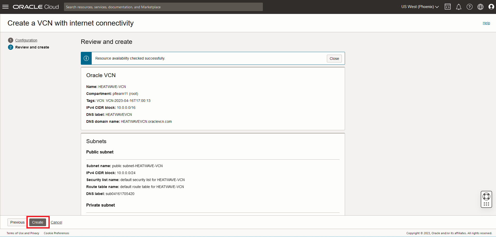

8. When the Virtual Cloud Network creation completes, click 'View Virtual Cloud Network' to display the created VCN
    

## Task 2: Configure security list to allow MySQL incoming connections

1. On HEATWAVE-VCN page under 'Subnets in (root) Compartment', click  '**Private Subnet-HEATWAVE-VCN**'
     

2. On Private Subnet-HEATWAVE-VCN page under 'Security Lists',  click  '**Security List for Private Subnet-HEATWAVE-VCN**'
    

3. On Security List for Private Subnet-HEATWAVE-VCN page under 'Ingress Rules', click '**Add Ingress Rules**'
    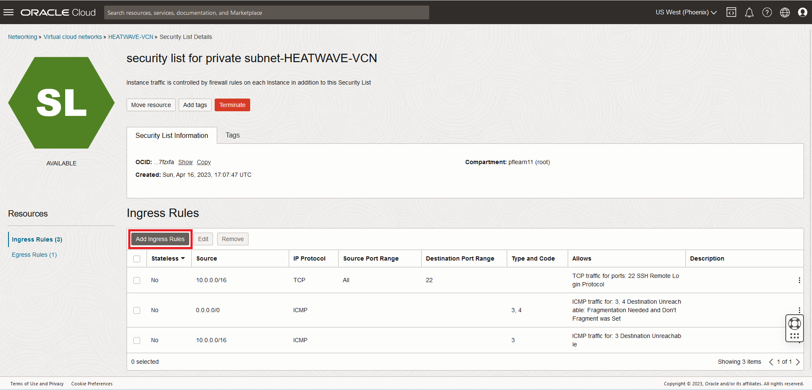

4. On Add Ingress Rules page under Ingress Rule 1

    a. Add an Ingress Rule with Source CIDR

    ```bash
    <copy>0.0.0.0/0</copy>
    ```

    b. Destination Port Range

    ```bash
    <copy>3306,33060</copy>
     ```

    c. Description

    ```bash
    <copy>MySQL Port Access</copy>
    ```

    d. Click 'Add Ingress Rule'
    

5. On Security List for Private Subnet-HEATWAVE-VCN page, the new Ingress Rules will be shown under the Ingress Rules List
    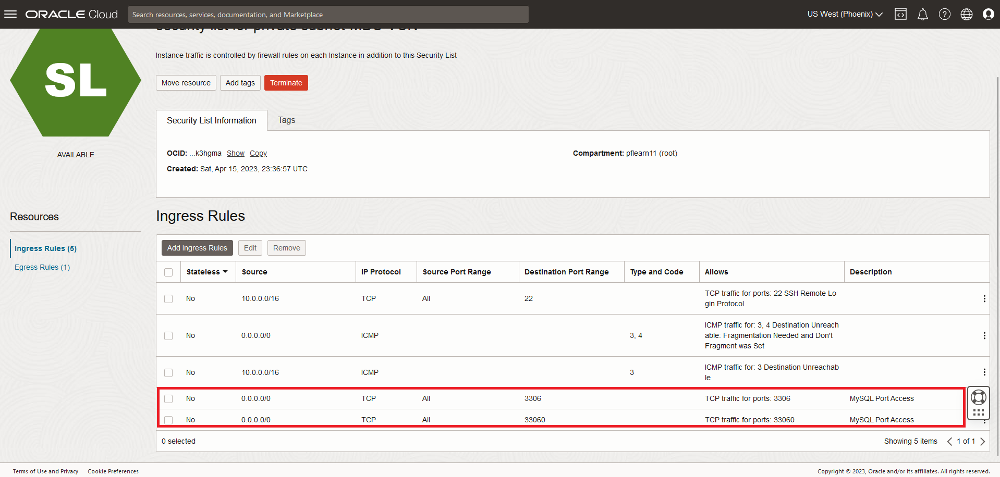

## Task 3: Configure security list to allow HTTP incoming connections

1. Navigation Menu > Networking > Virtual Cloud Networks

2. Open HEATWAVE-VCN

3. Click  public subnet-HEATWAVE-VCN

4. Click Default Security List for HEATWAVE-VCN

5. Click Add Ingress Rules page under Ingress Rule

    Add an Ingress Rule with Source CIDR

    ```bash
    <copy>0.0.0.0/0</copy>
    ```

    Destination Port Range

    ```bash
    <copy>80,443</copy>
    ```

    Description

    ```bash
    <copy>Allow HTTP connections</copy>
    ```

6. Click 'Add Ingress Rule'

    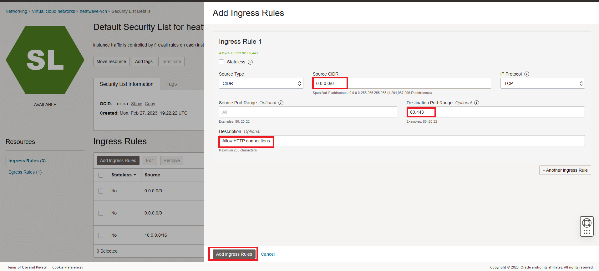

7. On Security List for Default Security List for HEATWAVE-VCN page, the new Ingress Rules will be shown under the Ingress Rules List

    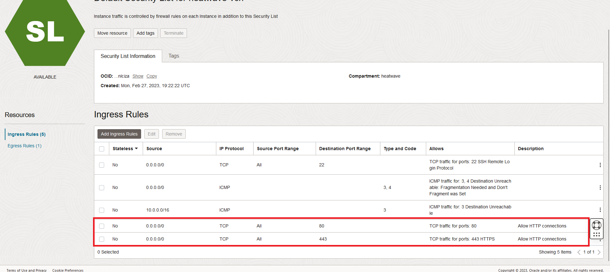

## Task 4: Create MySQL Database for HeatWave (DB System) instance

1. Click on Navigation Menu > Databases > MySQL
         Databases
         MySQL
    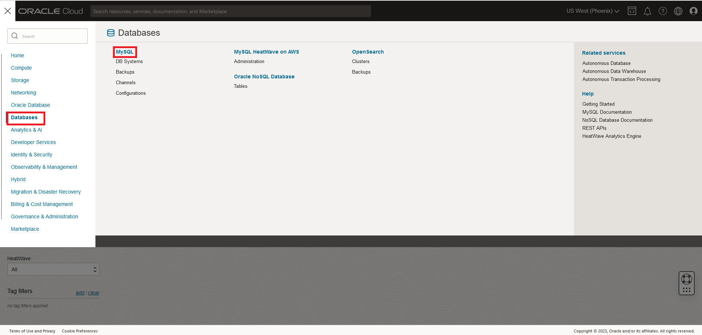

2. Click 'Create DB System'
    

3. Create MySQL DB System dialog by completing the fields in each section

    - Provide DB System information
    - Setup the DB system
    - Create Administrator credentials
    - Configure Networking
    - Configure placement
    - Configure hardware
    - Exclude Backups
    - Set up Advanced Options

4. For DB System Option Select **Development or Testing**

    

5. Provide basic information for the DB System:

    a. Select Compartment **(root)**

    b. Enter Name

    ```bash
    <copy>HEATWAVE-DB</copy>
    ```

    c. Enter Description

    ```bash
    <copy>MySQL HeatWave Database Instance</copy>
    ```

    d. Select **Standalone** and DISABLE **Configure MySQL HeatWave**
    

6. Create Administrator Credentials - **IMPORTANT** username must be set to **admin**  in order to successfully complete this workshop

    Username : **admin**

    Password*  (write password to notepad for later use)

    **Confirm Password** (value should match password for later use)

    

7. On Configure networking, keep the default values

    a. Virtual Cloud Network: **HEATWAVE-VCN**

    b. Subnet: **Private Subnet-HEATWAVE-VCN (Regional)**

    c. On Configure placement under 'Availability Domain'

    Select AD-1  ...  Do not check 'Choose a Fault Domain' for this DB System.

    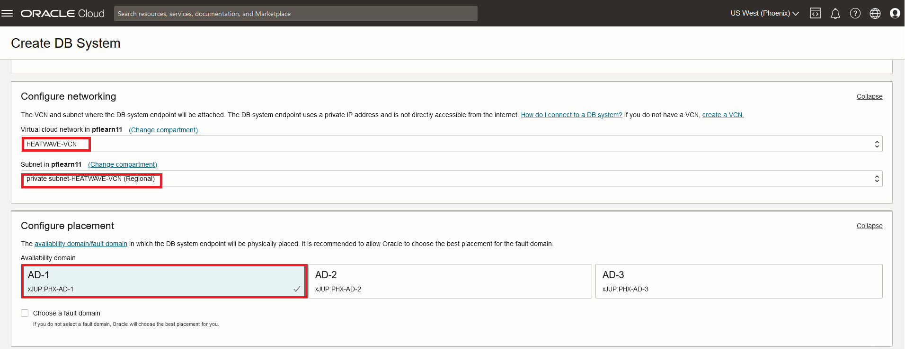

8. On Configure Backups, disable 'Enable Automatic Backup'

    

9. On Configure hardware
    - 1. **IMPORTANT** Check the  **Enable Heatwave** box
    - 2. Click the **Change shape** button to select **OCPU** then **MySQL.HeatWave.VM.Standard** shape and and click the **Select a Shape** button
    - 3. Click the **Configure HeatWave Cluster** button 
        - Select **Change shape**
        - Select **MySQL.HeatWave.VM.Standard** shape
        - Set **Node** to 1
        - Check the **MySQL HeatWave Lakehouse** box
        - Click the **Save Changes** button
    - 4. For Data Storage Size (GB) Set value to:  **512**

    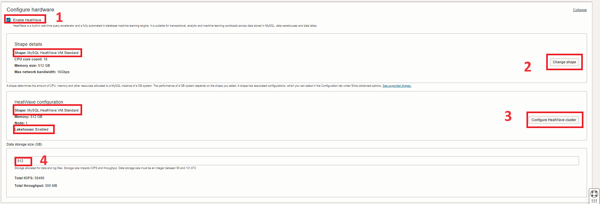

10. **IMPORTANT**
    > **NOTE** In order to successfully complete this workshop you must execute **steps 11, 12, and 13**

11. Click on Show Advanced Options

12. **IMPORTANT** Go to the Configuration tab. Click on **Select a MySQL version** and select the latest MySQL version of the DB system.

    

13. **IMPORTANT** Go to the Connections tab, in the Hostname field enter (your DB System Name):

    ```bash
        <copy>HEATWAVE-DB</copy> 
    ```  

    

14. Review **Create MySQL DB System**  Screen

    
  
    Click the '**Create**' button

15. The New MySQL DB System will be ready to use after a few minutes

    The state will be shown as 'Creating' during the creation
    

16. The state 'Active' indicates that the DB System is ready for use

    On HEATWAVE-HW Page, select the **Connections** tab and save the **Private IP**

    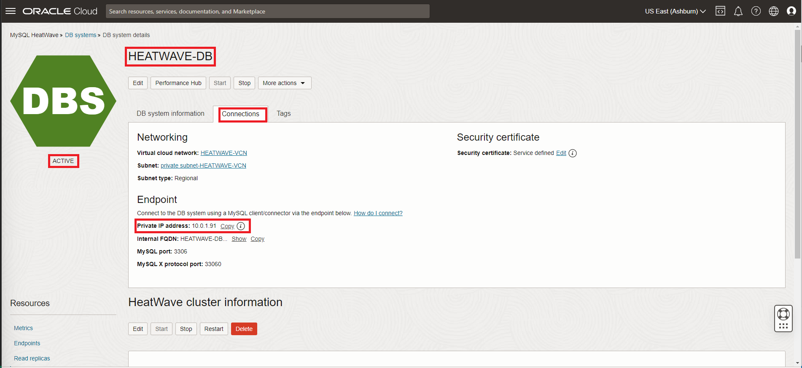

You may now **proceed to the next lab**

## Acknowledgements

- **Author** - Perside Foster, MySQL Principal Solution Engineering
- **Contributors** - Mandy Pang, MySQL Principal Product Manager,  Nick Mader, MySQL Global Channel Enablement & Strategy Manager, Selena Sanchez, MySQL Solution Engineering
- **Last Updated By/Date** - Perside Foster, MySQL Solution Engineering, March 2024