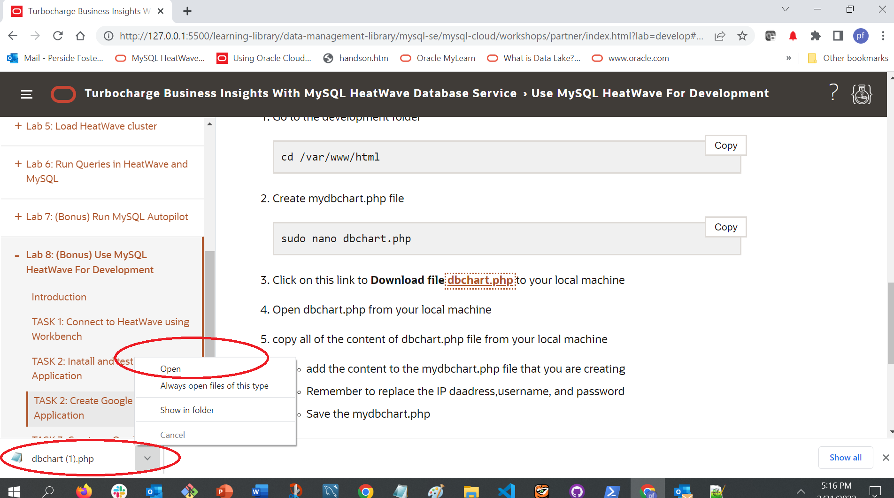
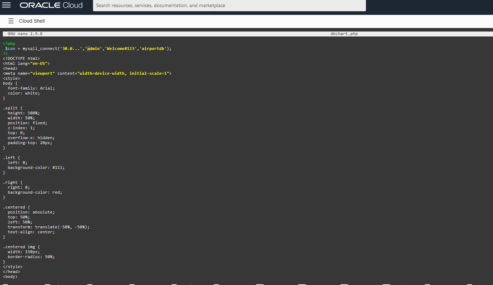
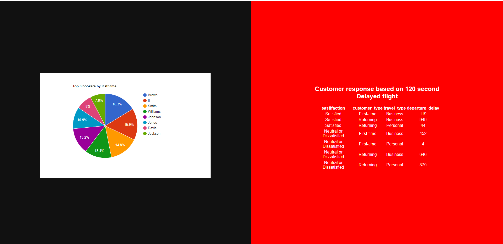

# Build LAMP Application with MySQL HeatWave


## Introduction

MySQL HeatWave can easily be used for development tasks with existing Oracle services, such as Oracle Cloud Analytics. New applications can also be created with the LAMP or other software stacks.


_Estimated Lab Time:_ 10 minutes

### Objectives

In this lab, you will be guided through the following tasks:

- Install Apache and PHP
- Create PHP / MYSQL Connect Application
- Create Lakehouse Google Chart Application
- Create Application AutoML Application

### Prerequisites

- An Oracle Trial or Paid Cloud Account
- Some Experience with MySQL Shell
- Must Complete Lab 6


## Task 1: Connect to Compute with SSH

1. Go to Cloud shell to SSH into the new Compute Instance

    (Example: **ssh -i ~/.ssh/id_rsa opc@132.145.170...**) 

    ```bash
    <copy>ssh -i ~/.ssh/id_rsa opc@<your_compute_instance_ip></copy>
    ```

## Task 2: Install Apache

1. Install app server

    a. Install Apache

    ```bash
    <copy>sudo yum install httpd -y </copy>
    ```

    b. Enable Apache

    ```bash
    <copy>sudo systemctl enable httpd</copy>
    ```

    c. Start Apache

    ```bash
    <copy>sudo systemctl restart httpd</copy>
    ```

    d. Setup firewall

    ```bash
    <copy>sudo firewall-cmd --permanent --add-port=80/tcp</copy>
    ```

    e. Reload firewall

    ```bash
    <copy>sudo firewall-cmd --reload</copy>
    ```

2. From a browser test apache from your loacal machine using the Public IP Address of your Compute Instance

    **Example: http://129.213....**

## Task 3: Install PHP

1. Install php:

    a. Install php:7.4

    ```bash
    <copy> sudo dnf module install php:7.4 -y</copy>
    ```

    b. Install associated php libraries

    ```bash
    <copy>sudo yum install php-cli php-mysqlnd php-zip php-gd php-mbstring php-xml php-json -y</copy>
    ```

    c. View  php / mysql libraries

    ```bash
    <copy>php -m |grep mysql</copy>
    ```

    d. View php version

    ```bash
    <copy>php -v</copy>
    ```

    e. Restart Apache

    ```bash
    <copy>sudo systemctl restart httpd</copy>
    ```

2. Create test php file (info.php)

    ```bash
    <copy>sudo nano /var/www/html/info.php</copy>
    ```

3. Add the following code to the editor and save the file (ctr + o) (ctl + x)

    ```bash
    <copy><?php
    phpinfo();
    ?></copy>
    ```

4. From your local machine, browse the page info.php

   Example: http://129.213.167.../info.php

## Task 4: – Create HeatWave / PHP connect app

1. Security update"   set SELinux to allow Apache to connect to MySQL

    ```bash
    <copy> sudo setsebool -P httpd_can_network_connect 1 </copy>
    ```

2.	Create config.php

    ```bash
    <copy>cd /var/www/html</copy>
    ```

    ```bash
    <copy>sudo nano config.php</copy>
    ```

3. Add the following code to the editor and save the file (ctr + o) (ctl + x)

    ```bash
    <copy><?php
    // Database credentials
    define('DB_SERVER', '10.0.1...');// HeatWave server IP address
    define('DB_USERNAME', 'admin');
    define('DB_PASSWORD', 'Welcome#12345');
    define('DB_NAME', 'airportdb');
    //Attempt to connect to MySQL database
    $link = mysqli_connect(DB_SERVER, DB_USERNAME, DB_PASSWORD, DB_NAME);
    // Check connection
    if($link === false){
        die("ERROR: Could not connect. " . mysqli_connect_error());
    }
    // Print host information
    echo 'Successfull Connect.';
    echo 'Host info: ' . mysqli_get_host_info($link);
    ?>
    </copy>
    ```

    - Test Config.php on Web sever http://150.230..../config.php

4. Create dbtest.php

    ```bash
    <copy>cd /var/www/html</copy>
    ```

    ```bash
    <copy>sudo nano dbtest.php</copy>
    ```

5. Add the following code to the editor and save the file (ctr + o) (ctl + x)

    ```bash
    <copy><?php
require_once "config.php";
$query = "select firstname, lastname, count(booking.passenger_id) as count_bookings from passenger, booking
where booking.passenger_id = passenger.passenger_id
and passenger.lastname = 'Aldrin' or (passenger.firstname = 'Neil' and passenger.lastname = 'Armstrong')
and booking.price > 400.00 group by firstname, lastname;";
if ($stmt = $link->prepare($query)) {
   $stmt->execute();
   $stmt->bind_result($firstname,$lastname,$count_bookings);
   echo "<table>";
        echo "<tr>";
        echo "<th>Firstname</th>";
        echo "<th>Lastname</th>";
        echo "<th>Count</th>";
    echo "</tr>";

    while ($stmt->fetch()) {
        echo "<tr>";
           echo "<td>" . $firstname ."</td>";
           echo "<td>" . $lastname . "</td>";
           echo "<td>" . $count_bookings . "</td>";
        echo "</tr>";
     }

    $stmt->close();
}
?>
    </copy>
    ```

6. From your local  machine connect to dbtest.php

    Example: http://129.213.167..../dbtest.php  

## Task 5: Create Google Chart Application to display Lakehouse data

1. Go to the development folder

    ```bash
    <copy>cd /var/www/html</copy>
    ```

2. Create mydbchart.php file

    ```bash
    <copy>sudo nano mydbchart.php</copy>
    ```

3. Click on this link to **Download file [dbchart.php](files/dbchart.php)**  to your local machine
4. Open dbchart.php from your local machine

    

5. copy all of the content of dbchart.php file from your local machine
    - add the content to the mydbchart.php file that you are  creating

        
    - Remember to replace the IP daadress,username, and password (lines 2 and 98 )
        - $con = mysqli_connect('30.0...','admin','Welcome#123','airportdb');
        - $link = mysqli_connect('30.0...','admin','Welcome#123','airportdb');
        
    - Save the mydbchart.php 

6. From your local  machine connect to dbtest.php

    Example: http://129.213.167..../mydbchart.php
    

## TASK 6: Create HeatWave ML Web App

1. Go to the development folder

    ```bash
    <copy>cd /var/www/html</copy>
    ```

2. Download application code

    ```bash
    <copy> sudo wget https://objectstorage.us-ashburn-1.oraclecloud.com/p/UfqwN3uKxYZlixYZz6ARjJ2KiZBiTMAheJkNdDpjabz13XhoMDKg1CIZmuSMDTqX/n/idazzjlcjqzj/b/airportdb-bucket-10282022/o/airportapp_automl.zip</copy>
    ```

3. unzip Application code

    ```bash
    <copy>sudo unzip airportapp_automl.zip</copy>
    ```

    ```bash
    <copy>cd airportapp</copy>
    ```

4. Replace the database IP in config.php file with your heatwave database IP and save the file.

    ```bash
    <copy>sudo nano config.php</copy>
    ```

7. Run the application as follows:

    http://computeIP/airportapp/eureka_index.php

    

**Congratulations!  You have successfully finished the Workshop.**

## Acknowledgements

- **Author** - Perside Foster, MySQL Principal Solution Engineering
- **Contributors** - Mandy Pang, MySQL Principal Product Manager,  Nick Mader, MySQL Global Channel Enablement & Strategy Manager, Selena Sanchez, MySQL Solution Engineering
- **Last Updated By/Date** - Perside Foster, MySQL Solution Engineering, March 2024