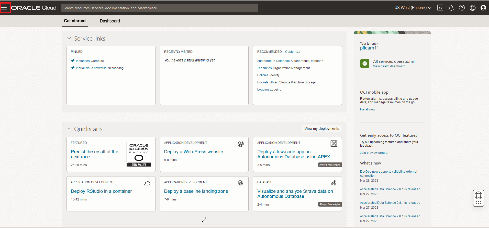
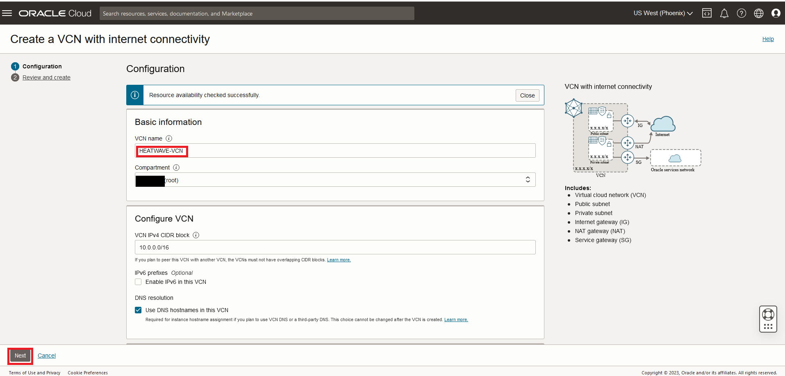
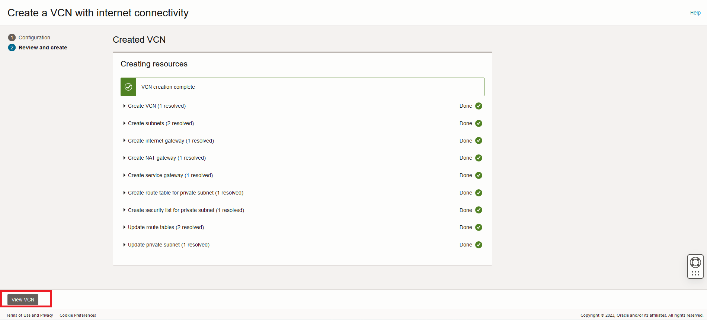

# Create MySQL HeatWave Instance


## Introduction

In this lab, you will create and configure a secure network on Oracle Cloud Infrastructure (OCI) that will be used to deploy a MySQL DB System.


_Estimated Time:_ 10 minutes

### Objectives

In this lab, you will be guided through the following tasks:

- Create Virtual Cloud Network
- Configure security list to allow MySQL incoming connections
- Configure security list to allow HTTP incoming connections

### Prerequisites

- An Oracle Trial or Paid Cloud Account
- Some Experience with MySQL Shell

## Task 1: Create Virtual Cloud Network

1. You should be signed in to Oracle Cloud!

    Click **Navigation Menu**,

    

2. Click  **Networking**, then **Virtual Cloud Networks**  
    

    Select the root compartment
    

3. Select the Click **Start VCN Wizard**
    

4. Select 'Create VCN with Internet Connectivity'

    Click 'Start VCN Wizard'
    

5. Create a VCN with Internet Connectivity

    On Basic Information, complete the following fields:

    VCN Name:

    ```bash
    <copy>HEATWAVE-VCN</copy>
    ```

    Compartment: Select  **(root)**

    Your screen should look similar to the following
    

6. Click 'Next' at the bottom of the screen

7. Review Oracle Virtual Cloud Network (VCN), Subnets, and Gateways

    Click 'Create' to create the VCN
    

8. When the Virtual Cloud Network creation completes, click 'View Virtual Cloud Network' to display the created VCN
    

## Task 2: Configure security list to allow MySQL incoming connections

1. On HEATWAVE-VCN page under 'Subnets in (root) Compartment', click  '**Private Subnet-HEATWAVE-VCN**'
     

2. On Private Subnet-HEATWAVE-VCN page under 'Security Lists',  click  '**Security List for Private Subnet-HEATWAVE-VCN**'
    

3. On Security List for Private Subnet-HEATWAVE-VCN page under 'Ingress Rules', click '**Add Ingress Rules**'
    

4. On Add Ingress Rules page under Ingress Rule 1

    a. Add an Ingress Rule with Source CIDR

    ```bash
    <copy>0.0.0.0/0</copy>
    ```

    b. Destination Port Range

    ```bash
    <copy>3306,33060</copy>
     ```

    c. Description

    ```bash
    <copy>MySQL Port Access</copy>
    ```

    d. Click 'Add Ingress Rule'
    

5. On Security List for Private Subnet-HEATWAVE-VCN page, the new Ingress Rules will be shown under the Ingress Rules List
    

## Task 3: Configure security list to allow HTTP incoming connections

1. Navigation Menu > Networking > Virtual Cloud Networks

2. Open HEATWAVE-VCN

3. Click  public subnet-HEATWAVE-VCN

4. Click Default Security List for HEATWAVE-VCN

5. Click Add Ingress Rules page under Ingress Rule

    Add an Ingress Rule with Source CIDR

    ```bash
    <copy>0.0.0.0/0</copy>
    ```

    Destination Port Range

    ```bash
    <copy>80,443</copy>
    ```

    Description

    ```bash
    <copy>Allow HTTP connections</copy>
    ```

6. Click 'Add Ingress Rule'

    

7. On Security List for Default Security List for HEATWAVE-VCN page, the new Ingress Rules will be shown under the Ingress Rules List

    

You may now **proceed to the next lab**

## Acknowledgements

- **Author** - Perside Foster, MySQL Principal Solution Engineering
- **Contributors** - Mandy Pang, MySQL Principal Product Manager,  Nick Mader, MySQL Global Channel Enablement & Strategy Manager, Selena Sanchez, MySQL Solution Engineering
- **Last Updated By/Date** - Perside Foster, MySQL Solution Engineering, April 2024