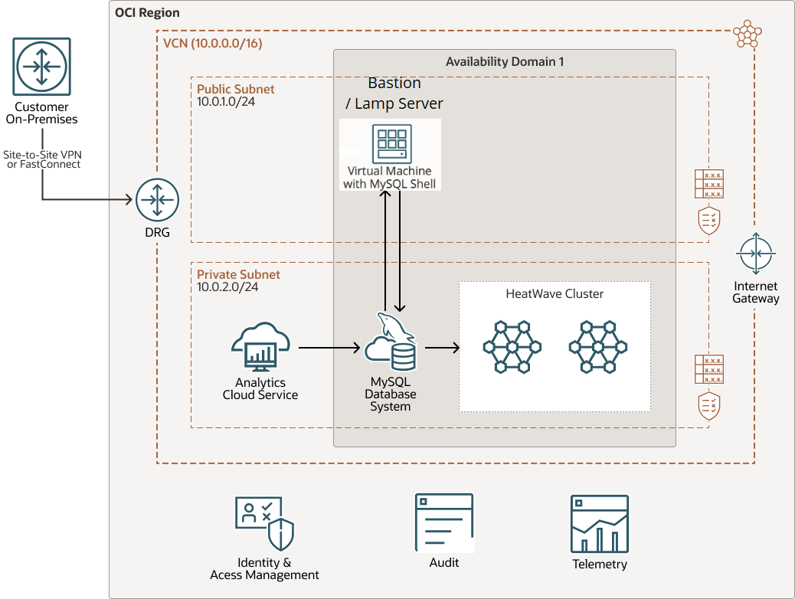

# Introduction

## About this Workshop

MySQL HeatWave is a fully managed database service with an integrated query accelerator which enables organizations to efficiently run transaction processing, real-time analytics, data warehouse and machine learning on data stored inside MySQL database or in the object store.

MySQL HeatWave eliminates the need for complex ETL operations to move data out of MySQL to run analytics or machine learning. Existing MySQL applications can run on MySQL HeatWave without any change and get orders of magnitude better query performance with the built-in query accelerator. With MySQL HeatWave, organizations can also run analytics on hundreds of terabytes of data in object store in a variety of file formats like CSV, Parquet, export files from Aurora or Redshift, without requiring data to be stored inside MySQL.

In this workshop, you will learn how to create a MySQL HeatWave Cluster, connect to the cluster using MySQL Shell, run queries on HeatWave, run Analytics workloads in Oracle Cloud, and create a LAMP application.

Overall this workshop will show you how easy it is to create and manage MySQL HeatWave and how MySQL HeatWave enables you to make informed business-critical decisions with real-time insights.

_Estimated Lab Time:_ 2 hours

## About Product/Technology

MySQL HeatWave is a massively parallel, high performance, in-memory query accelerator for Oracle MySQL Database Service that accelerates MySQL performance by orders of magnitude for analytics and mixed workloads. It is the only service that enables customers to run OLTP and OLAP workloads directly from their MySQL database without the need of ETL process. MySQL Autopilot uses advanced machine-learning techniques to automates the database lifecycle operations including provisioning, data loading, query processing, and error handling. This minimizes manual administrative work and further improves HeatWave’s usability, performance, and scalability. MySQL HeatWave is also integrated with other Oracle Cloud services such as Data Integration Service and Oracle Analytics Cloud to provide a seamless end-to-end integration.

MySQL Database Service with HeatWave is a fully managed service, optimized for Oracle Cloud Infrastructure. It enables you to:

- Instantly provision MySQL instances and connect to a production ready, pre-configured MySQL database.
- Run OLTP and OLAP workload directly on a single MySQL platform without the need of ETL, and no change in your applications.
- Efficiently run mixed and analytics workloads with best price performance. HeatWave is 6.5X faster than Amazon Redshift at half the cost, 7X faster than Snowflake at one-fifth the cost, and 1400X faster than Amazon Aurora at half the cost.
- Make more informed business decision by getting real-time insights from your operational data.
- Free up time of developers, DBAs, and DevOps to focus on value added tasks that are core to your business.
- Access to dozens of additional Oracle Cloud Services enabling organizations to embrace the shift to the cloud.

_Lab Setup

[//]:    

## Objectives

In this lab, you will be guided through the following steps:

- Create SSH Key on Oracle Cloud Infrastructure Cloud Shell
- Create MySQL Database for HeatWave (DB System) instance 
- Setup Compute instance
- Connect to DB System using MySQL Shell through Compute Instance / Cloud Shell and add sample data (airportdb)
- Add HeatWave cluster to DB System
- Load sample data to HeatWave Cluster
- Run queries in HeatWave and MySQL and see the performance improvement in HeatWave!
- Run MySQL Autopilot to get performance improvement suggestions
- Run queries again in HeatWave and see the improvement!
- Create Lamp test application
- Use Oracle Anayltics Cloud

## Prerequisites

- An Oracle Free Tier, Paid or LiveLabs Cloud Account
- Some Experience with MySQL Shell - [MySQL Site](https://dev.MySQL.com/doc/MySQL-shell/8.0/en/).

You may now **proceed to the next lab**

## Acknowledgements

- **Author** - Perside Foster, MySQL Principal Solution Engineering
- **Contributors** - Mandy Pang, MySQL Principal Product Manager,  Nick Mader, MySQL Global Channel Enablement & Strategy Manager
- **Last Updated By/Date** - Perside Foster, MySQL Solution Engineering, July 2023
