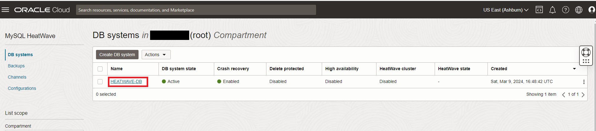
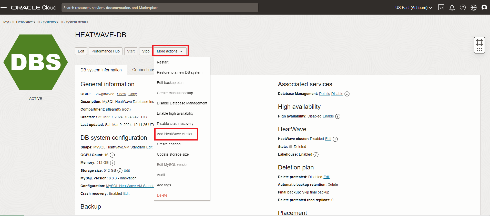
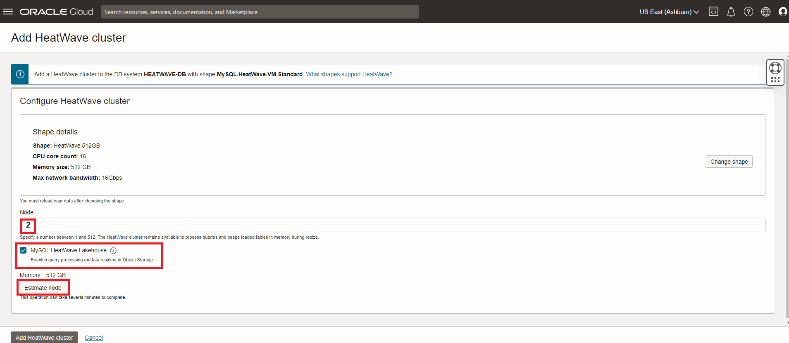
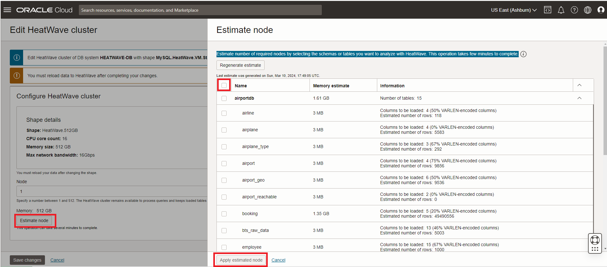
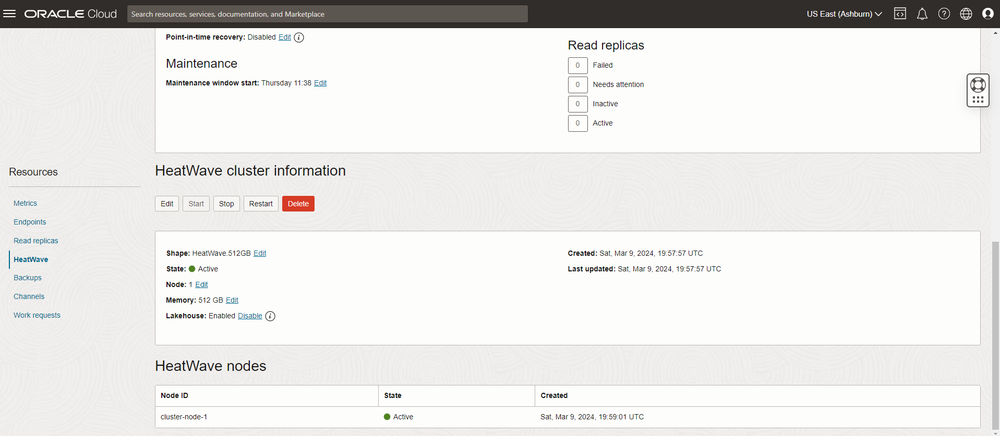
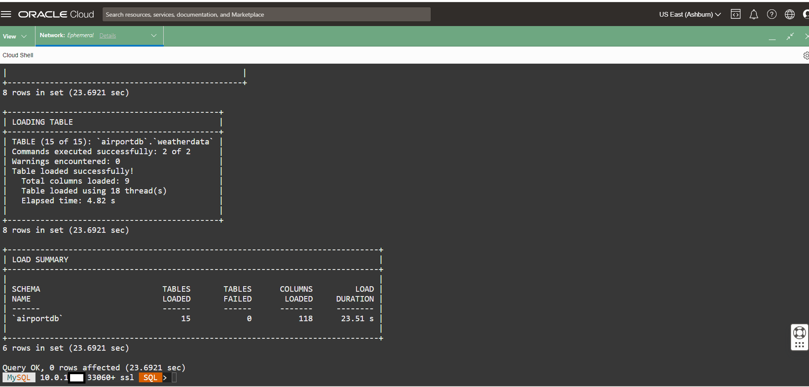
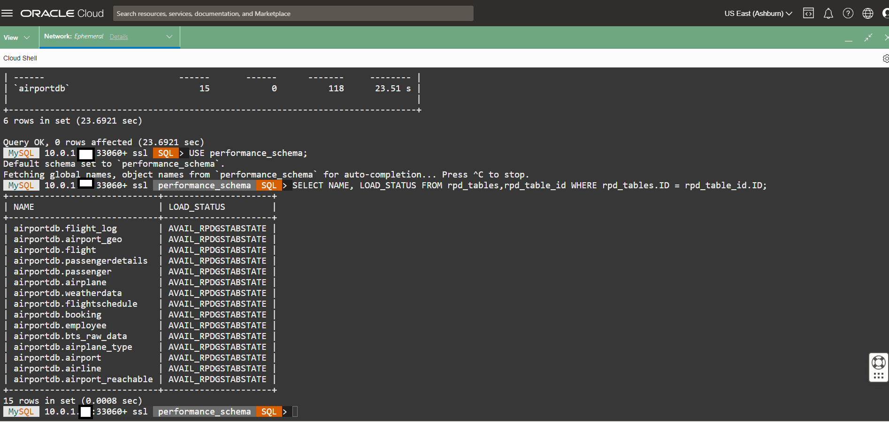

# Load Airportdb Data into HeatWave


## Introduction

A HeatWave cluster comprise of a MySQL DB System node and one or more HeatWave nodes. The MySQL DB System node includes a plugin that is responsible for cluster management, loading data into the HeatWave cluster, query scheduling, and returning query result.


_Estimated Time:_ 10 minutes

[//]:    [](youtube:OzqCt3XATto)

### Objectives

In this lab, you will be guided through the following task:

- Add a HeatWave Cluster to MySQL Database System
- Load Airportdb Data into HeatWave

### Prerequisites

- An Oracle Trial or Paid Cloud Account
- Some Experience with MySQL Shell


## Task 1: Add a HeatWave Cluster to MDS-HW MySQL Database System

1. Open the navigation menu  
    - Databases
    - MySQL
    - DB Systems
2. Choose the root Compartment. A list of DB Systems is displayed.
    

3. In the list of DB Systems, click the **HEATWAVE-DB** system. click **More Action ->  Add HeatWave Cluster**.
    

    >**Note** If the **HeatWave Cluster** is already enabled then skip to **Task 2**

    - a. Enable the **MySQL HeatWave LakeHouse** checkbox
    - b. Set **Node Count** to 1 
    - c. Enable the **MySQL HeatWave Lakehouse** checkbox
    - d. Click the **Add HeatWave Cluster** button to create the HeatWave cluster

        

    >**Note** You can let HeatWave estimate the number of required nodes for your data. Click the **Estimate Node** button,  then select the schemas or tables you want to analyze with HeatWave. This operation takes few minutes to complete.

    - 

4. HeatWave cluster creation will take about 10 minutes. From the DB display page scroll down to the Resources section. Click the **HeatWave** link. Your completed HeatWave Cluster Information section will look like this:
    

## Task 2: Load airportdb Data into HeatWave Cluster

1. Go to Cloud shell to SSH into the Compute Instance

    (Example: **ssh -i ~/.ssh/id_rsa opc@132.145.170...**) 

    ```bash
    <copy>ssh -i ~/.ssh/id_rsa opc@<your_compute_instance_ip></copy>
    ```

2. Connect to the HeatWave Database using MySQL Shell with the following command:

     ```bash
    <copy>mysqlsh -uadmin -p -h 10.0.1... --sql </copy>
    ```

    

3. Run the following Auto Parallel Load command to load the airportdb tables into the HeatWave Cluster.

     ```bash
    <copy>CALL sys.heatwave_load(JSON_ARRAY('airportdb'), NULL);</copy>
    ```

    - >**Note** The time required to load a table depends on data size. You can monitor load progress by issuing the following query, which returns a percentage value indicating load progress.

        ```bash
        <copy>SELECT VARIABLE_VALUE  FROM performance_schema.global_status  WHERE VARIABLE_NAME = 'rapid_load_progress';</copy>
        ```

4. The completed load cluster screen should look like this:

    

5. Verify that the tables are loaded in the HeatWave cluster. Loaded tables have an AVAIL_RPDGSTABSTATE load status.

     ```bash
    <copy>USE performance_schema;</copy>
    ```

     ```bash
    <copy>SELECT NAME, LOAD_STATUS FROM rpd_tables,rpd_table_id WHERE rpd_tables.ID = rpd_table_id.ID;</copy>
    ```

    

    >**Do not Execute now!** - Just in case you want to know...
    - To unload the airportdb schema from the HeatWave Cluster

     ```bash
    <copy>CALL sys.heatwave_unload(JSON_ARRAY("airportdb"),NULL);</copy>
    ```

You may now **proceed to the next lab**

## Learn More

- [Oracle Cloud Infrastructure MySQL Database Service Documentation](https://docs.cloud.oracle.com/en-us/iaas/MySQL-database)
- [MySQL Database Documentation](https://www.MySQL.com)

You may now **proceed to the next lab**

## Acknowledgements

- **Author** - Perside Foster, MySQL Principal Solution Engineering
- **Contributors** - Mandy Pang, MySQL Principal Product Manager,  Nick Mader, MySQL Global Channel Enablement & Strategy Manager, Selena Sanchez, MySQL Solution Engineering
- **Last Updated By/Date** - Perside Foster, MySQL Solution Engineering, March 2024