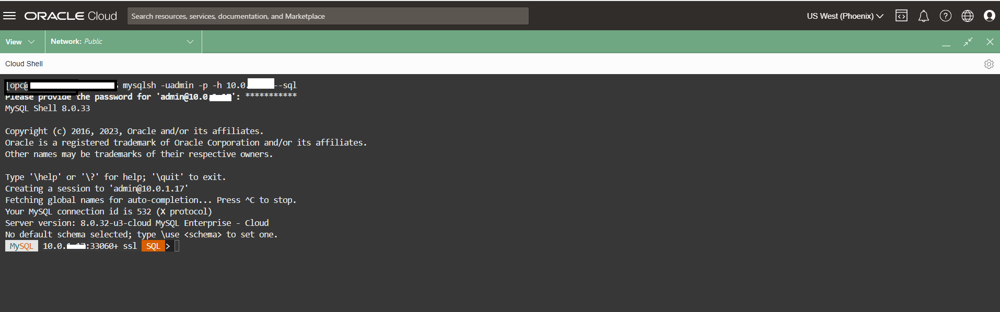
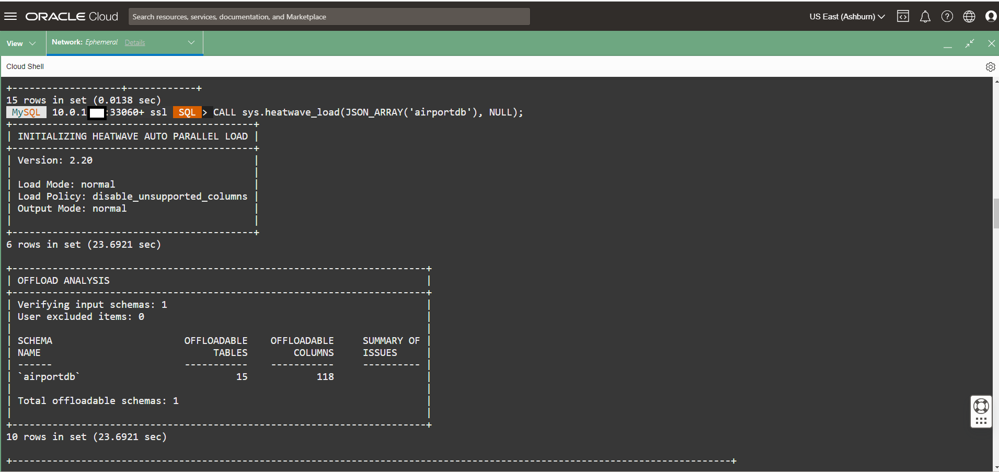

# Load Airportdb Data into HeatWave


## Introduction

A HeatWave cluster comprise of a MySQL DB System node and one or more HeatWave nodes. The MySQL DB System node includes a plugin that is responsible for cluster management, loading data into the HeatWave cluster, query scheduling, and returning query result.


_Estimated Time:_ 10 minutes

[//]:    [](youtube:OzqCt3XATto)

### Objectives

In this lab, you will be guided through the following task:

- Add a HeatWave Cluster to MySQL Database System
- Load Airportdb Data into HeatWave

### Prerequisites

- An Oracle Trial or Paid Cloud Account
- Some Experience with MySQL Shell


## Task 1: Add a HeatWave Cluster to MDS-HW MySQL Database System

1. Open the navigation menu  
    - Databases
    - MySQL
    - DB Systems
2. Choose the root Compartment. A list of DB Systems is displayed.
    

3. In the list of DB Systems, click the **HEATWAVE-DB** system. click **More Action ->  Add HeatWave Cluster**.
    

    - a. Enable the MySQL HeatWave LakeHouse checkbox
    - b. Set Node Count to 2 for this Lab and Click Add HeatWave Cluster to create the HeatWave cluster

        

4. HeatWave cluster creation will take about 10 minutes. From the DB display page scroll down to the Resources section. Click the **HeatWave** link. Your completed HeatWave Cluster Information section will look like this:
    

## Task 2: Load airportdb Data into HeatWave Cluster

1. Connect to OCI Cloud Shell
    

2. On command Line, connect to the HeatWave Database using the MySQL Shell client tool with the following command:

     ```bash
    <copy>mysqlsh -uadmin -p -h 10.0.1... --sql </copy>
    ```

    

3. Run the following Auto Parallel Load command to load the airportdb tables into HeatWave..

     ```bash
    <copy>CALL sys.heatwave_load(JSON_ARRAY('airportdb'), NULL);</copy>
    ```

    

4. The completed load cluster screen should look like this:

    

5. Verify that the tables are loaded in the HeatWave cluster. Loaded tables have an AVAIL_RPDGSTABSTATE load status.

     ```bash
    <copy>USE performance_schema;</copy>
    ```

     ```bash
    <copy>SELECT NAME, LOAD_STATUS FROM rpd_tables,rpd_table_id WHERE rpd_tables.ID = rpd_table_id.ID;</copy>
    ```

    

You may now **proceed to the next lab**

## Learn More

- [Oracle Cloud Infrastructure MySQL Database Service Documentation](https://docs.cloud.oracle.com/en-us/iaas/MySQL-database)
- [MySQL Database Documentation](https://www.MySQL.com)

You may now **proceed to the next lab**

## Acknowledgements

- **Author** - Perside Foster, MySQL Principal Solution Engineering
- **Contributors** - Mandy Pang, MySQL Principal Product Manager,  Nick Mader, MySQL Global Channel Enablement & Strategy Manager, Selena Sanchez, MySQL Solution Engineering
- **Last Updated By/Date** - Perside Foster, MySQL Solution Engineering, March 2024