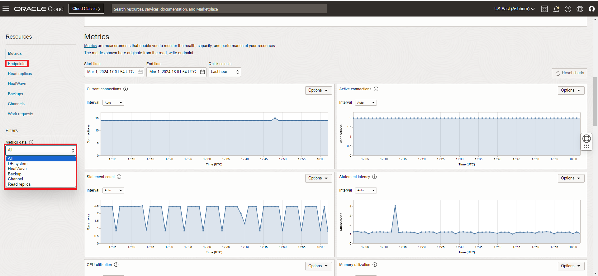

# Manage MySQL HeatWave Service

## Introduction

In this lab, you will learn how to Manage a MySQL HeatWave Service instance on Oracle Cloud Infrastructure (OCI) using the Oracle Cloud Console.

Estimated Time: 10 minutes

### Prerequisites

- An Oracle Free Tier, Always Free, Paid or LiveLabs Cloud Account
- Some Experience with MySQL Shell
- Create a local Secure Shell (SSH) key

## Task 1: View MySQL HeatWave Metrics

Do the following to view the metrics for your DB system:

1. Open the navigation menu and click Databases. Under MySQL HeatWave, click DB systems.
2. Choose the Compartment from the List scope.
3. Click the name of the DB system to open the DB system details page.
4. Under Resources, click Metrics.
5. Use the Metrics data filter to view metrics for a particular resource:
    - All: Displays metrics for all resources.
    - DB system: Displays metrics for the current DB system.
    - Backup: Displays metrics for all backups of the current DB system.

    

## Task 2: Start, Stop, or Reboot MySQL HeatWave System

1. Click the **Navigation Menu** in the upper-left corner, navigate to **Databases**, and select **DB Systems**.

   

2. List Database Systems.

   

3. Select the **HeatWave\_Sandbox** Compartment and click **HeatWave\_DB** to open the MySQL DB System Details page.

    

4. Select one of the following actions:

    - Start: Starts a stopped database system. After the database system is started, the **Stop** action is enabled and the **Start** option is disabled.
    - Stop: Stops a running database system. After the database system is powered off, the **Start** action is enabled.
    - Restart: Shuts down a database system, and restarts it.

     > **Note:**  Stopping a database system stops billing for all OCPUs associated with it.
       - Billing continues for storage.
       - Billing for OCPUs resumes if you restart the database system.
       - If you selected **Stop** or **Restart**, the Stop/Restart MySQL HeatWave Database System dialog box is displayed.

5. Select a shutdown type:

     - Fast: Flushes dirty pages before shutting down the database system. Some flush operations must        be performed during the next startup, potentially increasing the duration of the start-up    process.
     - Slow: Flushes dirty pages and purges undo log pages for older transactions. The shutdown itself can take longer, but the subsequent startup is faster.
     - Immediate: Does not flush dirty pages and does not purge any undo log pages. Stops MySQL immediately. Page flushes and log purging will take place during the next startup, increasing the duration of the start-up process.

6. Select the required shutdown type and click **Stop** or **Restart**, depending on the action chosen.

## Task 3: Delete the MySQL HeatWave DatabaseSystem

Deleting a database system is permanent. Any manual backups associated with the deleted database system are retained for their retention periods. Automatic backups are deleted with the database system.

1. Click the **Navigation Menu** in the upper-left corner, navigate to **Databases**, and select **DB Systems**.

    

2. List Database Systems.

    

3. Choose the **root** Compartment.

4. Click **HeatWave_DB** to open the MySQL DB System Details page.

    

5. From the **More Actions** drop-down list, select **Delete**.

      

6. Check the **Delete DB System Permanently** box and click the **Delete DB System** button.

    

When the delete process is done, **HeatWave_DB** will be set to the **Delete** status.

## Learn More

- [MySQL Heatwave Documentation](https://docs.oracle.com/en-us/iaas/mysql-database/)

- [MySQL HeatWave Database Documentation](https://www.mysql.com)

## Acknowledgements

- **Author** - Perside Foster, MySQL Principal Solution Engineering
- **Contributors** - Mandy Pang, MySQL Principal Product Manager,  Nick Mader, MySQL Global Channel Enablement & Strategy Manager, Selena Sanchez, MySQL Solution Engineering
- **Last Updated By/Date** - Perside Foster, MySQL Solution Engineering, March 2024
