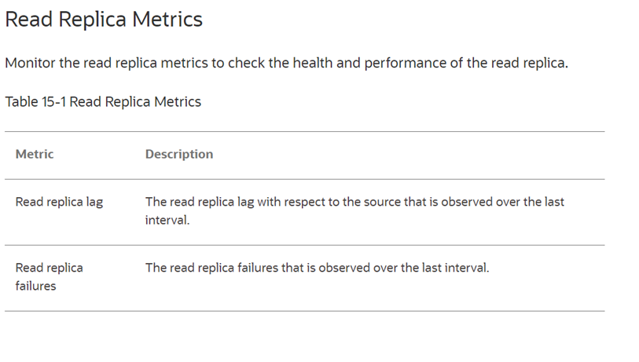

# Setup MySQL HeatWave Read Replicas

## Introduction

Read replicas are read-only copies of the primary MySQL instance of the DB system within the same region. Read replicas provide higher performance and durability for a DB system. They scale out reads, that is, reduce query latency. Any updates that you make to the source DB system is asynchronously copied to the read replicas.

For more details see OCI Document:
[MySQL HeatWave Read Replica](
https://docs.oracle.com/en-us/iaas/mysql-database/doc/read-replica.html).

_Estimated Time:_ 20 minutes

### Objectives

In this lab, you will be guided through the following task:

- Create a Read Replica
- Edit a Read Replica
- Monitor Read Replica Metrics

### Prerequisites

- An Oracle Trial or Paid Cloud Account
- Some Experience with MySQL Shell

## Task 1: Create a Read Replica

Use the Console to create a read replica of the DB system.

This task requires the following:
    - A running DB system.

Do the following to create a read replica:

1. Open the navigation menu and select Databases. Under MySQL HeatWave, click DB systems.
2. Choose the compartment from the List scope.
3. Click the name of the DB system to open the DB system details page.
4. Under Resources, click Read replicas.
5. Click Create read replica.
6. In the Create read replica panel, provide the following information:
    - Name: Specify the name of the read replica. If you do not define a name, MySQL HeatWave Service generates one for you in the format, MysqlReadReplicaDateTime.
    - Description: (Optional) Specify a description of the read replica.
    - Select a shape: (Optional) Click Select shape to change the shape of the read replica. You can select any shape with at least 8 ECPUs or 4 OCPUs. By default, a read replica uses the same shape as the DB system. See Supported Shapes.
    - Show advanced options: (Optional) Click the option to open a group of tabs that enable you to further configure the read replica.
    - Deletion plan: (Optional) Check the Delete protected box to protect the read replica and its associated DB system against delete operations. By default, read replicas and DB systems are not delete protected. If you want to delete either the read replica or its associated DB system, deselect the option.
        > **Note** The delete protected setting applies to individual read replica. If a read replica is delete protected, the DB system cannot be deleted.
    - Configuration:
        - Select a configuration: (Optional) Click Select Configuration to change the configuration of the read replica shape.
        > **Note** If you changed the shape of the read replica, you must select a configuration.

    - MySQL version: Select the MySQL version of the read replica. By default, a read replica uses the same MySQL version as its associated DB system. See MySQL Server Versions.
    - Tags: Use the tab to organize and track resources in the tenancy:
        - Tag namespace: Select the tag name.
        - Tag key: Select the tag key.
        - Tag value: Specify a value for the tag.
        - Add tag: Click this option to add more tags

7. Click Create read replica.

    **A read replica is created.**

## Task 2: Edit a Read Replica

You can edit the details and settings of a read replica.

Use the Console to edit a read replica of the DB system.

This task requires the following:
    - A running DB system.
    - A read replica.

Do the following to edit a read replica:

1. Open the navigation menu and select Databases. Under MySQL HeatWave, click DB systems.
2. Choose your compartment from the List scope.
3. Click the name of the DB system to open the DB system details page.
4. Under Resources, click Read replicas.
5. Do one of the following:
    - Click Edit from the Actions menu on the same line as the read replica.
    - Click the name of the read replica to open the Read replica details page, and then click Edit.

6. In the Edit read replica panel, change any of the following information:

    - Name: Change the name of the read replica if needed.
    - Description: (Optional) Change the description of the read replica if needed.
    - Select a shape: (Optional) Click Select shape to change the shape of the read replica. You can select any shape with at least 8 ECPUs or 4 OCPUs. By default, a read replica uses the same shape as the DB system. See Supported Shapes.
    - Show advanced options: (Optional) Click the option to open a group of tabs that enable you to further configure the read replica.
        - Deletion plan: (Optional) Change the Delete protected setting if needed.
        >**Note** The delete protected setting applies to individual read replica. If a read replica is delete protected, the DB system cannot be deleted.
        - Configuration:
            - Select a configuration: (Optional) Click Select configuration to change the configuration of the read replica shape.
            >**Note** If you changed the shape of the read replica, you must select a configuration.
        - MySQL version: Change the MySQL version of the read replica if needed. See MySQL Server Versions.
    - Tags: Use the tab to organize and track resources in the tenancy:
        - Tag namespace: Select the tag name.
        - Tag key: Select the tag key.
        - Tag value: Specify a value for the tag.
        - Add tag: Click this option to add more tags
7 Click Save changes.

## Task 3: Monitor Read Replica Metrics

Use the Console to monitor read replicas metrics.

1. Open the navigation menu and select Databases. Under MySQL HeatWave, click DB systems.
2. Choose your compartment from the List scope.
3. In the list of DB systems, find your DB system, and click the name of the DB system to open the DB system details page.
4. Select Metrics from the Resources list.
5. In the Metrics data filter, select Read replica to filter and view the read replica metrics.
6. (Optional) To edit and create a query on a metric, click Options, and then select View query in 7. Metrics Explorer. 
7. (Optional) To create an alarm on the query, click Options, and then select Create an alarm on this query.
8.Monitor the read replica metrics to check the health and performance of the read replica.
    

## Task 4: Describe the read replica load balancer

A read replica load balancer helps to distribute read traffic among the read replicas. When you create the first read replica, a read replica load balancer is created automatically, and all read replicas are added as a backend to the load balancer. If the read replica load balancer is not created for any reason, then the read replica is not created either. A read replica load balancer is deleted only when you delete the associated DB system.

For more details see OCI Document:
[Read replicas on MySQL Database Service](https://blogs.oracle.com/mysql/post/read-replicas-mysql-database-service).

## Task 5: Connect to a read replica

You can connect to a read replica in a similar way as you connect to a DB system - using a compute instance, bastion session, or VPN. See **Lab 3: Connect to HeatWave with MySQL Shell and Workbench**.

For more details see OCI Document:
[Overview of Read Replica](https://docs.oracle.com/en-us/iaas/mysql-database/doc/overview-read-replica.html#:~:text=You%20can%20connect%20to%20a,the%20read%20replica%20lag%20metric).

You may now **proceed to the next lab**

## Acknowledgements

- **Author** - Perside Foster, MySQL Principal Solution Engineering
- **Contributors** - Mandy Pang, MySQL Principal Product Manager,  Nick Mader, MySQL Global Channel Enablement & Strategy Manager, Selena Sanchez, MySQL Solution Engineering
- **Last Updated By/Date** - Perside Foster, MySQL Solution Engineering, March 2024